# 我们为什么一定要吃蔬菜？

首先，我们熟悉一下蔬菜的分类。按照颜色分：蔬菜分为深色和浅色，深色还可以分为深绿色、深红色、深紫色、深橙色。利用颜色划分非常简单，容易操作，建议一分为二，一半绿色、一半彩色。

绿色蔬菜以菠菜、油菜、莜麦菜、茼蒿等叶类蔬菜为主。

彩色蔬菜的选择就更多了，有红色（番茄、红彩椒）、橙色（胡萝卜、南瓜）、紫色（紫甘蓝、紫洋葱）、黄色（黄彩椒、黄番茄）、白色（白萝卜、口蘑）等。按照种类分：除了常见的绿叶类蔬菜，蔬菜家族里还有瓜果类、根茎类、水草海藻，以及菌菇、木耳、银耳等菌类蔬菜。

味道相对好的蔬菜推荐生吃，比如新鲜的小番茄、黄瓜、彩椒、生菜、苦苣。绝大多数蔬菜，都可以做熟了吃。但蔬菜中的维生素、抗氧化物普遍怕热，所以叶类菜适合沸水快焯，其他蔬菜适合急火快炒，整体上都适合缩短烹饪时间，以便保留更多营养素。

蔬菜味道寡淡，想要做出一份好吃的菜肴，免不了要用油、盐，甚至是糖。做菜时调制好吃的酱汁、适度使用食用油都很有必要，可以让蔬菜变得柔软好吃，提升食欲。但过度使用油和盐不仅会掩盖食材本身的味道，还会给健康带来沉重的负担。

地三鲜、油焖茄子、干炸香菇、干锅菜花都是典型的重口味菜肴。如果经常选择这样吃蔬菜，即便吃够量，也很难收获健康。

# 主食如何安排更健康？

前面我们将主食分成了三大类，第一类是精制主食，第二类是杂粮杂豆，第三类是根茎薯类。

其中，精制主食的缺点大于优点，而第二类和第三类相对健康些，因此建议以1∶1∶1来搭配。

不要额外吃红薯和玉米等看似健康的主食，否则只会增加主食总量，让我们更容易发胖。正确的方法应该是用红薯、玉米替换掉一部分精制主食，减少精制主食的比例。

想要吃得健康，要减少以下三类主食：含有大量糖和脂肪的主食：

●比如酥饼、曲奇、起酥面包、手抓饼、月饼等。油炸的主食：

●如油条、炸薯条、炸春卷等。重复的主食：

●如包子+粥、比萨+意大利面、凉皮+白吉馍、土豆丝+米饭等。

我是这样吃的：

●吃米饭和粥时，一定要混搭些杂粮，一开始混合1/3的杂粮，时间久了慢慢适应就可以提高杂粮的比例。我现在最少也是用一半的杂粮混搭一半的大米。

●选择全麦粉、燕麦粉作为烘焙原料。

●经常把红薯、紫薯当作主食。

●在外吃饭遇到土豆、莲藕、山药时，会将它们作为主食，而不再额外吃大米饭或其他主食。

●很少吃油炸或高油脂主食，买煎饼时去掉薄脆。

●吃甜品的当天，减少正餐的主食。

# 杂粮这么基础，原来也有套路！

常见但非全谷物的杂粮：

●玉米糁：去掉了胚芽，保留了麸皮

●脱皮玉米粉：去掉了胚芽和麸皮

●胚芽米：去掉了麸皮，保留了胚芽

●胚芽裸燕麦米：去掉了麸皮，保留了胚芽

以上所谓的杂粮，都经过了不同程度的加工。虽然这些谷物的营养价值并不如全谷物高，但依然比精制米面更富有营养，同时往往拥有不错的口感，可以大胆选择。但是，市面上有很多产品，打着杂粮的旗号却并不健康，需要我们多留意。比如脂肪含量很高的杂粮饼干、声称粗粮但实际上以小麦粉为主的杂粮面条、杂粮口味的乳饮料和膨化零食，都不值得买。

推荐购买的全谷物：

全麦粉、糙米、小米、玉米、燕麦米、荞麦（粉）、大麦、青稞、黑麦、高粱米、莜麦（粉）、黑米、薏米、藜麦等。

推荐购买的杂豆：

红豆、绿豆、鹰嘴豆、豌豆、芸豆、腰豆、花豆、蚕豆、扁豆等。

生的杂粮杂豆含水量都比较低，推荐食用量跟精米面相同，每人每顿70～100克即可。这个推荐量针对的是一般轻体力劳动者，如果是个头高、运动量大、重体力劳动的男性，可以在这个基础上继续增加。

注意，不要因为觉得杂粮杂豆更健康就多吃，其实它们与精制米面的能量差不多，只不过营养密度更大，不产生热量的营养物质含量更丰富，会给身体带来更多益处。

无须浸泡：精大米、胚芽米、小米、绿豆、藜麦、小粒玉米糁、玉米面想要快速煮粥、煮饭，适合选择它们进行组合搭配。提前浸泡0.5～2小时：糙米、紫米、黑米、红米、荞麦、燕麦米

短时间浸泡即可有较好的口感，如果电饭煲有杂粮烹饪功能，也可以直接烹煮。提前浸泡4小时以上：红豆、芸豆、薏仁、鹰嘴豆

# 根茎薯类营养大揭秘

蔬菜中有一大类被看作主食，那就是高淀粉薯类，主要包括土豆、山药、红薯、紫薯、芋头等。

从大分类上来说，它们属于蔬菜，所以同等重量下水分占比较大，总能量比米饭低。相比谷类主食，根茎薯类的钾元素、维生素C和膳食纤维含量更高，餐后血糖上升速度较慢，对于控制体重、稳定血压、促进排便都有积极作用。

不过跟谷类相比，薯类蛋白质含量较低，所以长期单一选择薯类作为主食也并不合理。《中国居民膳食指南（2022）》的推荐量为每天50～100克，半个拳头就达标了。

未来，希望我们可以养成更健康的饮食习惯，至少在餐桌上出现含薯类的菜肴时，可以有意识地减少米饭的摄入，平衡一餐的总热量。

红心红薯的甜度、水分、类胡萝卜素含量都比白心红薯更高。我们吃到的烤红薯通常是红心品种，吃起来口感会更好。

白心红薯的水分和类胡萝卜素含量少，淀粉含量更高些，口感比较干面，甜度也相对较低。蒸着吃或者煮饭会更合适。

紫薯和红薯都属于甘薯，但红薯的甜度和水分整体比紫薯更高，类胡萝卜素含量也较高。紫薯水分和甜度更低，但蛋白质含量更高，而且富含花青素，具有抗氧化作用。两者口感有差别，不过营养价值都很高。

山药经常与木耳同炒。口感脆脆的山药，是淀粉含量较低、水分含量较大的菜山药（淀粉含量约12%）。通常被认为具有养生功效的铁棍山药，是高淀粉品种（淀粉含量约20%），看起来很细，也没什么水分，口感很面，更适合蒸熟或者煮粥当主食吃。

芋头和山药都富含黏液，去皮后摸起来黏黏滑滑，吃起来也是如此。这是由于它们含有某类植物多糖，其具有保健功效，尤其对于改善血脂异常有帮助。

# 面粉和面包，选购有技巧

去超市买全麦面包时经常遇到产品“名不副实”的情况，比如包装上明明写的是全麦面包，但仔细查看配料表会发现，第一位仍是小麦粉，全麦粉的占比并不高。

《中国居民膳食指南（2022）》推荐每天摄入200～300克谷类，其中全谷物和杂豆为50～150克。虽然科学上全谷物的益处一直被强调，但也没有苛刻地要求每日的主食要100%全谷物。能有一半当然最好，只占1/3也勉强能接受。

所以，大家面对一块不是100%全麦的面包时，也不必那么嫌弃和紧张。

●有营养标签的预包装全麦面包怎么选？

阅读配料表和营养成分表，配料表第一位应是全麦粉，糖和油的排位靠后一些更好。营养成分表中脂肪和钠的数值越小越好。●无营养标签的全麦面包怎么选？

看：全麦面包整体为浅褐色，质感略粗糙，不如白面包那么细腻。

尝：试吃时口感较粗糙，相对干、硬、有嚼劲，麦香味浓郁。

问：向店主咨询全麦粉的含量。

面包本来应该是西方版的“馒头”，而不应该是“甜点”。同时，鉴于消费者对“全麦面包”的价值认同，很多商家可能会借概念来“伪造”全麦面包，比如增加色素使面包呈现浅褐色，或在小麦粉中混入肉眼可见的麸皮来混淆视听等。

常见面粉种类●全麦粉：以整粒小麦为原料，经清杂、磨粉等制粉工序制成，且小麦胚乳、胚芽与麸皮的相对比例与天然完整谷粒几乎一样，且膳食纤维的含量必须大于等于9%。●标准粉：通俗地讲，是一百斤麦子磨出八十五斤小麦粉的面粉，也叫八五粉，根据加工精度来分类。●高筋粉：蛋白质含量高，占10.5%～13.5%。●低筋粉：蛋白质含量低，占6.5%～8.5%。

全麦粉的挑选要点●看外观

全麦粉的颜色呈浅褐色，质感没有小麦粉那么细腻，闻起来有麦香味。但有些配制面粉采用普通小麦粉混合部分麸皮，肉眼可见麦麸碎片。看一下配料表就知道它是否仅仅是配制，如果是，这种不叫全麦粉，不属于全谷物。全麦粉应该是完整的小麦磨成的粉，由胚乳、麸皮、胚芽按照小麦自身的比例构成。

产品名称标注“全麦粉”或“全麦面粉”。●看膳食纤维含量

根据2015年开始施行的行业标准LS/T 3244-2015，膳食纤维的含量要达到9%以上，其标志物烷基间苯二酚的含量应大于等于200微克每克。一般正规的厂家都会标注。●选小包装

全麦粉包含更多的营养成分，胚芽中的脂肪、维生素E容易氧化酸败，产生有害的自由基，膳食纤维等成分也容易吸水受潮，导致面粉发霉。●尽量不选择预拌粉

预拌粉直接可以进行烘焙，简单方便，但因为很可能是在小麦粉的基础上额外增加白砂糖、泡打粉等添加物，不如单纯的面粉健康。

# 五花八门的燕麦

相较于其他谷物，燕麦的蛋白质含量、脂肪含量更高，味道更好。同时，燕麦中的可溶性膳食纤维（尤其是β-葡聚糖）含量很高，有助于改善血脂状况，控制餐后血糖水平。

胚芽裸燕麦是将燕麦米外面的麸皮抹掉一部分（损失了一部分膳食纤维和维生素），处理后燕麦的口感更好。而钢切燕麦只是将燕麦进行简单切断，生燕麦片就是直接把燕麦粒压扁。以上粗加工的燕麦产品需要煮熟了再吃，但是烹煮时间比原粒燕麦要短一些。

燕麦粉就是将原始燕麦磨成粉，像全麦粉一样，可以用于家庭烘焙和馒头、烙饼制作之类的。如果尝试后觉得不太喜欢100%燕麦粉的口感，你也可以在小麦粉中混合30%～50%的燕麦粉，在平衡口感的同时增加营养。

快熟燕麦、即食燕麦都是将燕麦预先制熟，简单冲泡或者烹煮几分钟就可以吃。需要留意的是，切得非常碎的燕麦片，虽然方便、口感好，但消化吸收速度也比一般燕麦更快一些。虽然其膳食纤维含量不低，但餐后血糖上升速度仍然较快。这种算是精细加工的主食，B族维生素损失也较多，不能算作健康天然的全谷物。

●其他燕麦产品（推荐）：燕麦奶

●其他燕麦产品（不推荐）：含植脂末的燕麦冲饮

# 可健康可不健康的面条

面条家族里还有一个营养价值不错的，就是意大利面。意大利面的原料是杜兰小麦，这是一种硬粒小麦。与我们常吃的小麦粉不同，它磨制的面粉较粗，呈黄色，蛋白质含量高，吸水性强，很耐煮，消化速度也比较慢，是一种相对健康的面食。意大利面算是最符合中国胃的西式食物之一，很方便用中餐的方式烹调，有直身、螺丝、弯管、蝴蝶、空心、贝壳等多种形状，对应的最佳烹煮时间不同。还有不少彩色意大利面，适合买给孩子吃。

# 不会自己做馒头，超市的面点能替代吗？

值得注意的是，即便是合规的高品质面点，也不建议经常吃，而是要适当控制食用频率。这些食物毕竟是精制主食，除了提供能量，其他营养物质都很贫乏，建议每天只留一餐的份额给它们。

在超市买预包装面点时，还请阅读一下配料表，观察杂粮和小麦粉的排列顺序，谁排前面，谁的含量就更高一些。

如果杂粮粉（全麦粉、玉米粉、燕麦粉、荞麦粉等）的排位在小麦粉之前，这就是一款货真价实的杂粮面点啦！若认准了品牌，也可以复购，提高生活的便利度。

# 蛋白质与高蛋白食物

如果一种食物所含的蛋白质里集合了这9种必需氨基酸，并且这9种必需氨基酸的含量高低与人体需求的比例比较匹配，吃进来后利用率较高，这种蛋白质就属于完全蛋白质。

富含完全蛋白质的食物，我们可以称之为高蛋白食物。这些完全蛋白质主要存在于鱼虾水产、禽畜肉、蛋、奶、大豆这五大类食物当中。想要简单记忆，可以默念“鱼、肉、蛋、奶、豆”这五个关键字。

一种食物所含的蛋白质中已经凑齐了9种必需氨基酸，但是比例不符合我们的需求，而且一些关键的氨基酸含量太低（比如面粉中的赖氨酸含量很低），那这些食物含有的蛋白质，就被称为半完全蛋白质。

比如谷薯类主食里所含的蛋白质，绝大多数都属于半完全蛋白质，利用率较低，需要搭配肉奶蛋一起食用才能提升蛋白质利用率。当然也有例外，像是越来越受热捧的藜麦，它所含的蛋白质属于完全蛋白质。

如果一种食物里所含的蛋白质中连这9种必需氨基酸都凑不齐，就叫不完全蛋白质。这样的蛋白质品质最差、利用率最低。只摄入不完全蛋白质，是不能支撑生命存续的。大名鼎鼎的胶原蛋白，就属于不完全蛋白质，严重缺少色氨酸。

吃富含胶原蛋白的食物，如猪脚、鸡爪、阿胶、燕窝等，并不会像想象中那样吃完就能给脸上补充胶原蛋白。吃进来的食物要被消化后才能吸收，而这些食物中富含的蛋白质大都属于不完全蛋白质，所含必需氨基酸种类不全，消化成氨基酸被吸收后，就像缺少配件的七巧板，利用率很低。

人体每日所消耗的能量来源中，蛋白质占比10%～15%。脂肪和碳水化合物才是主要的供能物质，碳水化合物提供每天所需能量的50%～65%，脂肪提供20%～30%。

蛋白粉就是以蛋白质为主的单一营养素补充剂，虽然蛋白质“浓度”高，但只能补充蛋白质这一种营养素。而鱼、肉、蛋、奶、豆这些高蛋白食物，不仅富含蛋白质，同时含有其他营养素。比如牛奶中的钙、红肉中的铁元素和B族维生素、水产类食物中的锌元素和多不饱和脂肪酸等。

# “鱼”——水产类食物

简单一点，鱼类可分为淡水鱼、海水鱼。

表2-7　鱼的分类

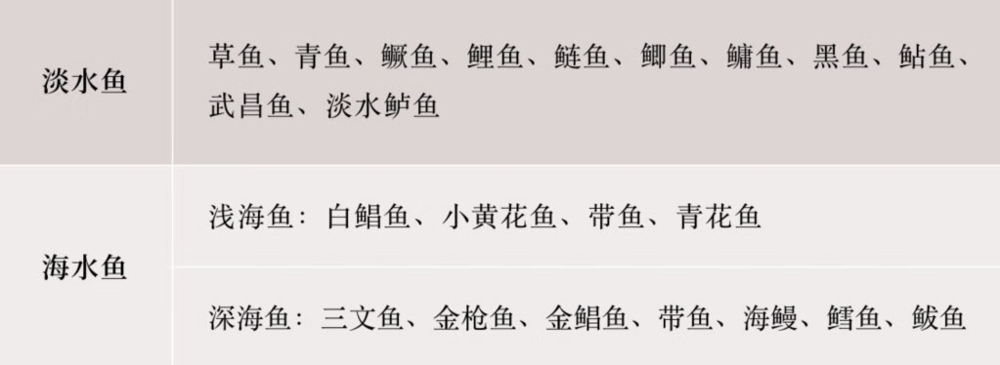

每周至少吃2次鱼虾类水产，可以作为健康饮食的一项指标。

大型深海鱼类的寿命比较长，长期食用含有汞等重金属的小鱼、小虾，且摄入的重金属不能通过代谢完全排出体外，就会在体内逐步积累。它们的寿命越长，就积累得越多。

因此，一些售价不菲的深海大型肉食鱼类体内的重金属含量，反而比普通平价鱼更高，更不安全。FDA（美国食品药品监督管理局）特别提醒，孕妇与儿童为了减少摄入危害健康的重金属，不要食用鲨鱼、黄鳍金枪鱼、旗鱼等大型肉食鱼类。

表2-8　部分深海鱼营养数据（每100克含量）

* 数据来源：《中国食物成分表（标准版）》第二册，美国农业部网站。

表2-9　部分淡水鱼营养数据（每100克含量）

* 数据来源：《中国食物成分表（标准版）》第二册。

鱼类含有一类很重要的营养物质，那就是多不饱和脂肪酸，尤其是ω-3脂肪酸，诸如DHA（二十二碳六烯酸）、EPA（二十碳五烯酸）。这些多不饱和脂肪酸，在低温的环境中依然不会凝固，能保持较好的流动性。普遍来说，越是深海和生活环境水温比较低的鱼类，多不饱和脂肪酸的含量也越高。

《中国居民膳食指南（2022）》推荐每周吃两次鱼虾贝类，总分量在500克左右。这个推荐量指的是去掉头尾、鱼骨后，可以吃进肚子的部分（营养学术语叫作可食部）。

想要追求口感，家庭在购买冷冻鱼时也要掌握科学的解冻方式。最好放置在冷藏室或冰箱的解冻室缓慢解冻。这是因为在冷冻过程中，食物水分会凝结产生冰晶戳破细胞，解冻太快时细胞内的水分和营养物质来不及被吸收，就会从细胞破损处流出，很多营养和风味物质也会随之丢失，鱼肉的风味和质感就会大幅下降

# “肉”——肉类食物

肉，也是非常重要的完全蛋白质的来源，同时含有B族维生素、铁元素等重要营养物质，是饮食中不可或缺的部分。

肉类分为禽、畜两大类，禽类包括鸡、鸭、鹅、火鸡、鸽子、鹌鹑等，畜类包括猪、牛、羊、兔、驴等哺乳动物。日常生活里提到肉类时，也常说禽畜类，最常见的就是鸡鸭鹅、猪牛羊。

刚才提到每人每天的肉类摄入推荐量是40～75克，纯瘦肉的话，大概还没有一个手掌心大，相当于大半块鸡胸肉，或者一副扑克牌的体积。

表2-11　猪肉营养成分数据（每100克含量）

* 数据来源：《中国食物成分表（标准版）》第二册。

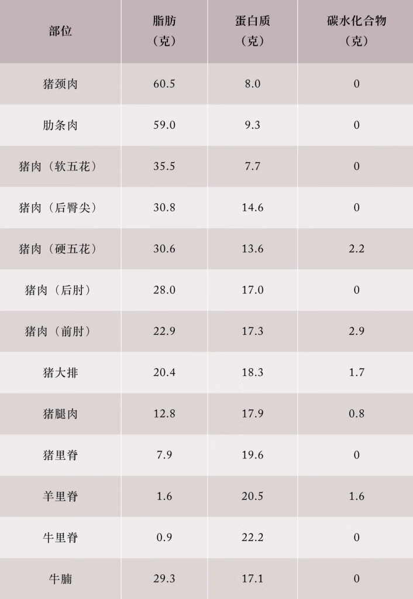

所以，要吃猪牛羊这些畜肉的话，建议吃瘦肉，越红越好。

# “蛋”——蛋类食物

《中国居民膳食指南（2022）》推荐每人每天吃1个鸡蛋，不要刻意丢弃蛋黄。

不过鸡蛋里的酯类物质受热容易被氧化，所以嫩煮、嫩煎最好，蛋清凝固，蛋黄微微凝固，不溏不硬。过火的炒蛋、长时间煮或卤，都会使胆固醇氧化，而氧化的胆固醇对心血管健康的危害更大一些，这是日常生活中需要避免的。

蛋类不仅仅包括鸡蛋，还有鹌鹑蛋、鹅蛋、鸭蛋、鸽子蛋等，但整体营养价值差不多，性价比最高的是鸡蛋。鸡蛋的外壳也有不同的颜色，粉白色、浅咖色甚至淡青绿色。这只是品种的差别，营养差别不大。而小规模生产的土鸡蛋、大规模工业化生产的鸡蛋，营养差别也不大。饲料不同，蛋黄中的一些微量营养素的成分会产生差异，使得不同鸡蛋的风味有所不同。

所以，储存鸡蛋要遵循科学方法，不必因为担心沙门氏菌而将鸡蛋用水清洗后再放入冰箱，以免破坏鸡蛋表面的保护膜，缩短鸡蛋的储存时间。

当然，养成好习惯，一次不购买太多，及时放入冰箱储存，就可以常常吃到新鲜的鸡蛋啦！

# “奶”——奶制品

《中国居民膳食指南（2022）》推荐，每天要摄入300～500毫升的奶或其他奶制品。

奶制品是绝对的“钙量霸主”，我们身体所需要的钙，绝大多数都需要通过它摄入。

“巴氏灭菌乳”指经过巴氏消毒（在72摄氏度的热管道中杀菌15秒）后进行包装的牛奶，营养成分以及风味保留率很高，但牛奶中的细菌并没有被全部杀灭，必须冷藏保存并在一周内喝完，新鲜度很高。

“超高温灭菌乳”则是经过了超高温瞬间灭菌（135摄氏度杀菌1～2秒）后进行包装的牛奶，细菌基本完全杀灭，但高温下维生素和风味有一定程度的损失，在常温下可以保存一个月、半年甚至一年，优点就是便于储存。

奶源越好，蛋白质和钙质的含量会越高，无论买巴氏灭菌乳还是超高温灭菌乳，这个原则都适用。

为了应对补钙的需求，市面上也出现了额外添加钙成分的高钙奶。向牛奶中额外添加钙的技术难度大，所以一般添加量并不高，会增加10%～20%。牛奶本身含钙量就很丰富，增加的这部分“钙”并不会带来巨大差异，且多数吸收效果也没有牛奶本身的钙好。

相比之下，有些奶源比较优质的高端奶，本身的原生钙含量就较高，比如每100毫升钙含量达到120毫克，比普通高钙奶更值得购买。

在没有肥胖和血脂异常问题的情况下，每天喝300～500毫升普通牛奶就可以，倒不必专门喝脱脂奶。但如果确实有减肥、调理血脂的需求，或者每天奶摄入量超过500毫升，还是建议选择脱脂奶或者低脂奶，从而减少全天的饱和脂肪酸摄入量。

乳糖不耐受，也成为国人饮奶量达标的重要障碍。针对这个问题，我们需要找到特定的解决方案。目前有三种可行的办法：饮用0乳糖牛奶、喝酸奶、吃奶酪。

0乳糖牛奶是将牛奶中的乳糖提前水解后得到的牛奶产品，也常被叫作舒化奶，口感不同于传统牛奶，略微偏甜。而酸奶会在发酵的过程中由乳酸菌分解掉一部分乳糖，绝大多数人都可以耐受。奶酪在整个制作过程中会脱去液体的乳清，乳糖也会被随之脱去，所以奶酪中几乎不含有乳糖。

即使是乳糖不耐受者，每日也能耐受10克乳糖。所以，如果你本身有乳糖不耐受的症状，那么一方面可以少量、随餐喝牛奶，尽量不喝冰牛奶，另一方面要积极地通过0乳糖牛奶、酸奶、奶酪来增加奶制品摄入量，保证钙的需求得到满足。

如果你想要长期将酸奶作为主要的奶制品，那一定要学会挑选酸奶，并逐渐让自己适应天然酸奶的味道，养成吃酸奶的好习惯。

常见的含糖酸奶

配料表：生牛乳、白砂糖、稀奶油、乳清蛋白粉、羟丙基二淀粉磷酸酯、琼脂、益生菌

常见的无糖酸奶

配料表：生牛乳、保加利亚乳杆菌、嗜热链球菌

为了迎合消费者的喜好，让酸奶更“浓郁”，生产者会加入明胶等增稠剂来调节质感。明胶这种添加物虽然并没有什么害处，但总的来说相当于在食物中“滥竽充数”，只提供口感不提供关键营养，最终会降低食物整体的营养价值。

不可忽视的一点是，食用代糖仍易促成嗜甜的口味习惯。尤其是孩子，如果从小就养成嗜甜的饮食习惯，未来就更加难以改变。

在奶酪制作过程中会把水分脱去，所以溶于水的营养成分也会一并被脱去，比如乳糖、水溶性维生素、乳清蛋白。乳清蛋白占牛奶中蛋白质总量的20%左右，占比可不小，所以看由全脂奶制作的奶酪的营养成分表时，若发现蛋白质含量低于脂肪，这是正常的。

当然，有些奶酪用脱脂奶、部分脱脂奶来制作，也有些奶酪在制作过程中会用到脂肪酶，那这种奶酪中蛋白质含量会与脂肪含量相当，甚至远高于脂肪含量，营养价值很高。

●鲜酪

鲜酪是指不用发酵或者发酵程度特别低的奶酪。

乳清奶酪也是鲜酪的一种。鲜酪的盐含量普遍较低，不耐放，但营养价值很高，也适合小朋友吃，口味比较接近不含糖的原味酸奶，很清淡。

●白霉软质奶酪

顾名思义，就是外面长了一层白毛的奶酪，在国内比较容易买到。

有些人说，蓝纹奶酪像臭豆腐一样，闻着臭，吃着香。其实蓝纹奶酪并不是臭，而是风味比较有特色，也有一些菌菇香气。

图2-15　蓝纹奶酪

蓝纹奶酪在国内超市也容易买到。整体偏咸，盐含量比较高。

●洗皮奶酪

顾名思义，洗皮奶酪是在发酵过程中外皮要洗一洗的奶酪。

顾名思义，压制奶酪就是施加压力制作而成的奶酪。所以这类奶酪的水分被挤得更干，更硬实，发酵周期也很长，甚至以年来计。

压制奶酪范围非常广，品种非常多，是国内超市里最常见的品种。它也是很多人对西方奶酪的第一印象，比如动画片《猫和老鼠》当中常见到的大孔奶酪（埃门塔尔奶酪）就属于压制奶酪。

其中大孔奶酪是我最为推荐，适合中国家庭消费的奶酪。这种瑞士奶酪含盐量非常低，一般在200毫克每100克，味道也淡一些，绝大多数人可以适应。软硬适中，既可以切成小丁作为加餐直接吃，也可以切成片来制作三明治，非常方便。

需要留意的是，国内超市里充斥着大量品质较低的再制干酪，就是在模仿这种压制奶酪的质感，尤其是片状三明治奶酪，需要查看配料表来辨别。

其中奶酪棒就是非常有特色的产品。但这些奶酪棒无论宣传得有多么健康，看看成分表你就会发现它们跟传统天然奶酪有着较大差别。这种差别集中在两个方面：浓缩程度低、碳水化合物含量高。

所以奶酪冻的真正制作方法是将部分奶酪混入牛奶等液体，再加入一些食用胶等成分，让它凝固，呈现弹性质感。这种制作方法并非像天然奶酪那样先加入凝乳酶使得水分析出而被脱去，再进行浓缩。所以奶酪棒的整体水分含量较高，蛋白质含量比较低。同时因为水分并没有被脱去，加了牛奶的奶酪棒仍然会有乳糖。

《中国居民膳食指南（2022）》推荐儿童每天要摄入300～500毫升牛奶或相应奶制品，以保证优质蛋白和钙的摄入量。

儿童对钙的摄入需求高，通过奶酪棒多补一点也可以，但同时给孩子吃钙片的家长就要注意一下，不要重复补充，以免过量。

。稀奶油继续加工，在不同的加工方式下分别可以得到奶油或者黄油，这两种食物的脂肪含量都非常高，同时含有一些脂溶性维生素和少量蛋白质。

植物奶油、植物黄油、植脂淡奶便是以这种氢化植物油为原料，再加入香精等添加剂制作而成的，营养价值大打折扣。它们的质感、使用方式甚至风味，都与奶油、黄油、淡奶相似，却不是用牛奶提取的，而是由植物油制作而成，真的可以称之为赝品了。

而氢化植物油在加工过程中极易产生反式脂肪酸，这是一种十分不健康的成分，会威胁我们的心脑血管健康。[3]含有氢化植物油、反式脂肪酸的食物，能不吃就不吃。

常见的使用这类植物奶油、植物黄油的食物，主要有饼干、面包、甜品、蛋糕等。追求健康的话，这些食物要尽量少吃。即便是天然奶油、天然黄油这样饱和脂肪酸含量较高的油脂，也建议少吃，更何况那些有更多潜在健康威胁的油了。

# “豆”——大豆类食物

大豆的碳水化合物含量很低，而完全蛋白质和脂肪含量较高，我们可以通过营养成分组成看到明显的不同。

大豆无论怎么煮最后仍是相对完整的，而淀粉含量高的杂豆煮到最后会呈现沙沙的质感，可以做成豆泥，比如绿豆沙、红豆沙、鹰嘴豆泥等，这样区分简单明了。

在植物界中，富含完全蛋白质的食物非常少见，而平价的大豆便是屈指可数的完全蛋白质的植物性来源。与鱼肉蛋奶不同的是，大豆在提供完全蛋白质的同时，还可以提供膳食纤维和多种植物化学物，后者包括大豆异黄酮、植物甾醇、低聚糖、大豆皂苷等，这些成分可以帮助身体代谢胆固醇，对高血脂、肥胖都有缓解作用。

当体内的雌激素分泌过多时，大豆异黄酮可以干扰抢位，降低雌激素的作用，对于人体雌激素分泌过多导致的乳腺、子宫、卵巢等方面的疾病，有缓解作用。而当体内雌激素分泌过少时，大豆异黄酮又有一定的补位作用，可以协助缓解更年期综合征，预防骨质疏松。

大豆可以提供植物完全蛋白质、多种维生素、有益的植物化学物，而不用担心胆固醇、饱和脂肪酸的问题，是非常健康的食物。太爱吃肉的人，用豆制品替换一部分肉，可以帮助自身改善心血管状态。《中国居民膳食指南（2022）》推荐每天吃25克大豆，或者相应分量的豆制品，以25克大豆为原料（大约一瓷勺），可以制成各种豆制品，含水量不同，成品克数也不一样，换算大致如下：豆浆365毫升、豆腐干55克、豆腐丝40克、北豆腐72.5克、南豆腐140克。想要保证每天的份额，以上选项中的任意一种都可以。

豆浆几乎保留了所有的大豆营养，虽然膳食纤维在过滤豆渣的过程损失了一些，但含量仍然不低，其中有不少水溶性大豆低聚糖。豆浆中的钙含量仅有牛奶的1/10，虽然看起来也呈乳白色，但并不能替代牛奶，推荐两者都喝。

除了新鲜豆浆，市面上还有豆浆粉这样的方便产品。不过品质良莠不齐，购买时需要仔细分辨。高品质豆浆粉仅含有大豆，蛋白质含量可高达40%，而有些豆浆粉（更像是豆浆饮料粉）为了提高溶解性和甜味，会增加麦芽糖浆、白砂糖等配料，蛋白质含量会下降一半甚至更多。在一些早餐店，豆浆是使用甜味豆浆粉冲调出来的，营养浓度比较低，偶尔买来喝还可以，不建议每天早上都喝这种豆浆。

●原味豆浆：适合想要补充完全蛋白质的人。

●五谷豆浆：适合没时间吃饭，同时需要补充能量的人。

●坚果类豆浆：适合需要更强的饱腹感，希望饮用后血糖不会迅速上升的人。

豆腐是非常传统的豆制品，由大豆经过浸泡、磨浆、过滤、煮浆、凝固、压制脱水等工序制作而成。在制作过程中胰蛋白酶抑制剂、植酸等阻碍营养吸收的成分会被破坏，营养吸收率比原始大豆更高。整粒大豆的蛋白质消化率仅为65%，豆浆达到85%，而豆腐能达到95%。[1]

大豆本身钙含量并不高，点豆腐的时候如果使用了含有钙的凝固剂，就会增加豆腐中的钙含量。

千叶豆腐已经不是天然食物，而是用简单的原料精细化加工的食品。从营养价值上来说，除了能补充完全蛋白质，其他营养物质都十分贫乏。

豆腐干的制作步骤与豆腐基本上一样，只不过在达到豆腐的程度之后需要继续脱去50%左右的水分，因此体积变得更小，营养物质也更为浓缩。

豆腐干营养密度大，体积更小，不会占据很大的胃容量，非常适合作为家庭配菜。使用硫酸钙、氯化钙等凝固剂的豆腐干，钙含量较高，营养价值很高。

干豆皮、腐竹没有点豆腐这个步骤，没有引入外来的钙，所以它们跟豆浆的营养成分接近，钙含量很低。

豆腐乳、豆豉、黄豆酱也是发酵豆制品，可惜盐含量很高，并不适合像普通豆制品那样大口吃。不过，如果烹饪时不放盐，而是换成这类发酵豆制品来调味，多少还能获得一些额外的营养。

# 大千世界里的水果

除了维生素、抗氧化物、植物化学物，水果还含有丰富的有机酸，可以促进消化液分泌、增进食欲，有利于营养素的吸收。同时，水果含有丰富的膳食纤维，尤其是果胶。果胶是一种可溶性膳食纤维，有助于增强肠道蠕动，促进菌群生态平衡。这也是水果的营养优势之一。

《中国居民膳食指南（2022）》推荐每人每天摄入200～350克水果，差不多是1～2个拳头的分量。不过想要多吃一些也不是不行。虽然水果含糖量较高，但依然比垃圾食品健康得多。如果用水果替代那些不健康的零食，即便适度超量食用也未尝不可。

仁果类

特征：果实内有果芯，果芯内有多颗种子。

表2-21　仁果类每100克可食用数据

* 数据来源：《中国食物成分表（标准版）》第一册。

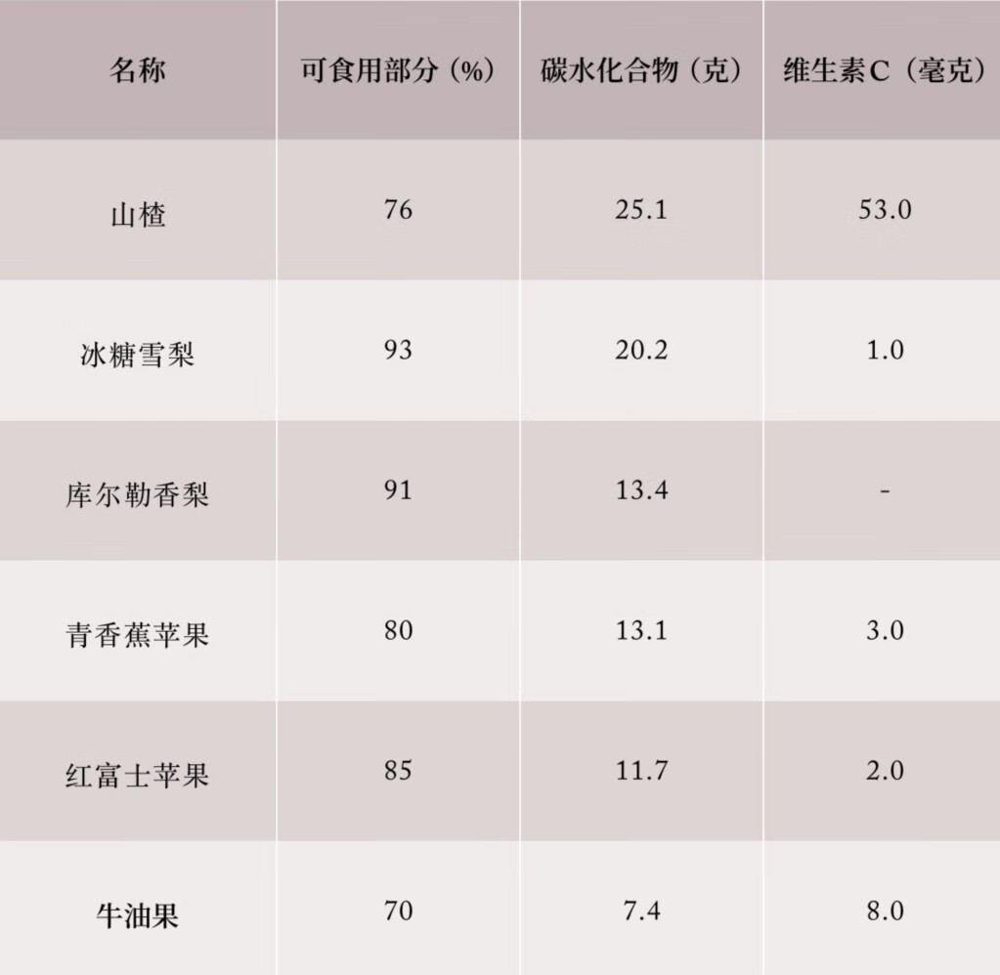

核果类

特征：果实内有一颗大核，核内还有仁。

表2-22　核果类每100克可食用数据

* 数据来源：《中国食物成分表（标准版）》第一册。

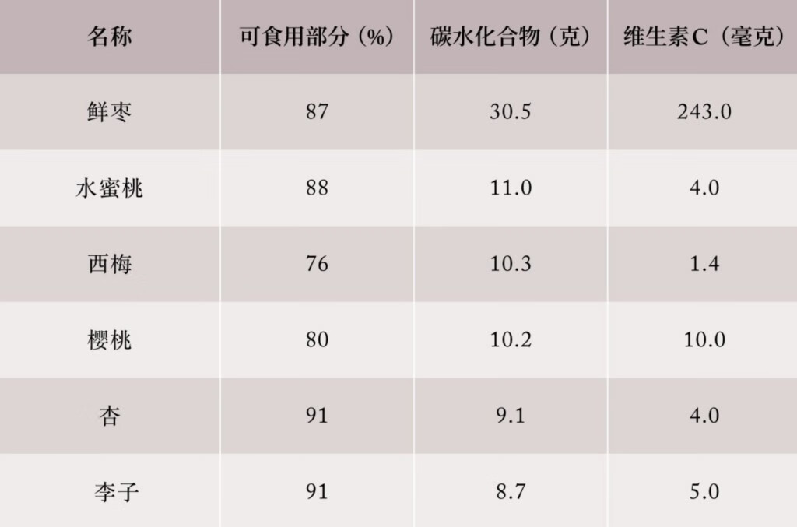

浆果类

特征：果实浆汁多，种子小而数量多，散布在果肉内。

表2-23　浆果类每100克可食用数据

* 数据来源：《中国食物成分表（标准版）》第一册。

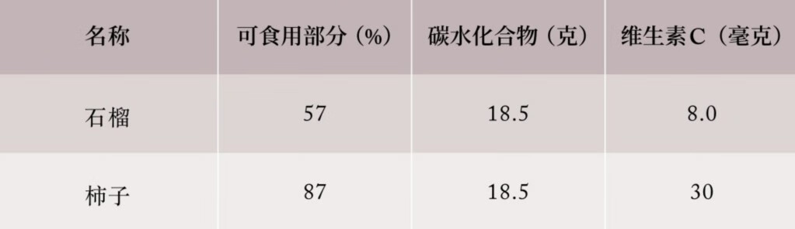
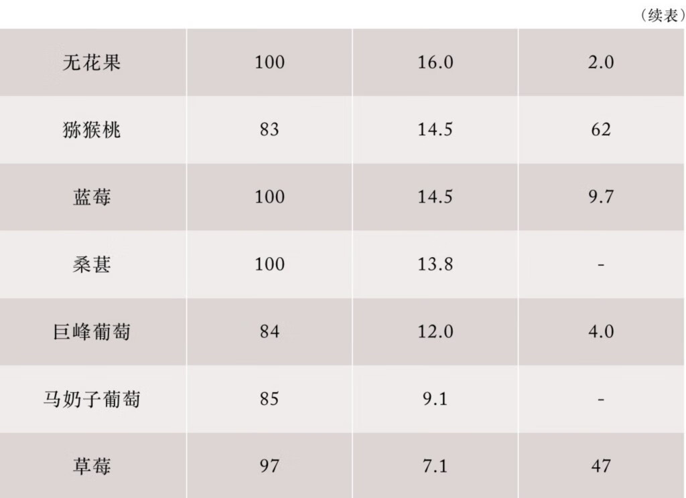

瓜果类

特征：有外皮，内瓤甜度更高。

表2-24　瓜果类每100克可食用数据

* 数据来源：《中国食物成分表（标准版）》第一册。

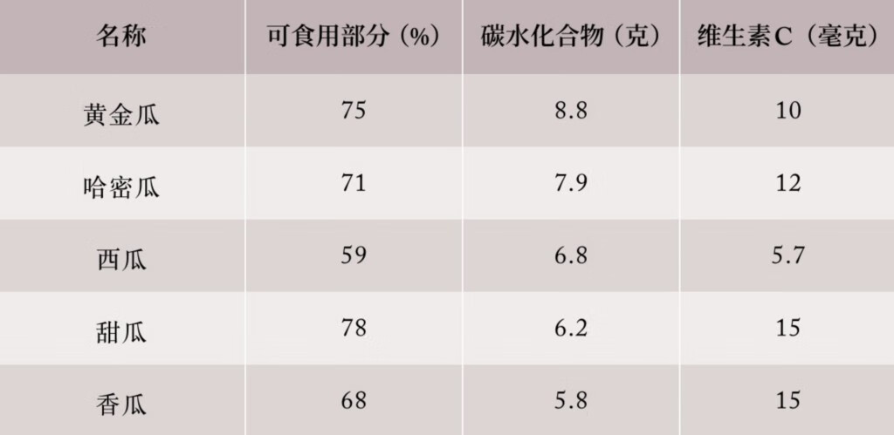

柑橘类

特征：果形接近圆形，果肉为分瓣的状态。

表2-25　柑橘类每100克可食用数据

* 数据来源：《中国食物成分表（标准版）》第一册。

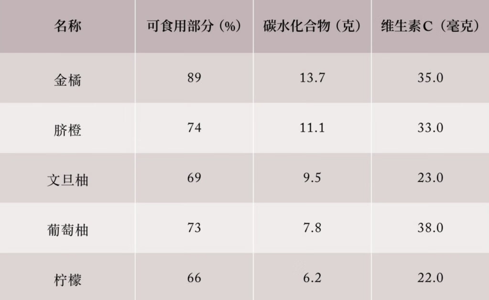

热带、亚热带水果

特征：主要产地在热带、亚热带。

表2-26　热带、亚热带水果每100克可食用数据

* 数据来源：《中国食物成分表（标准版）》第一册。

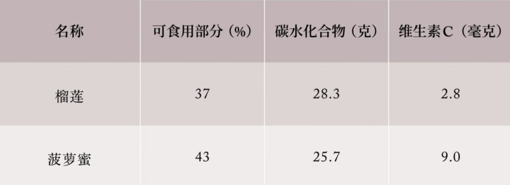
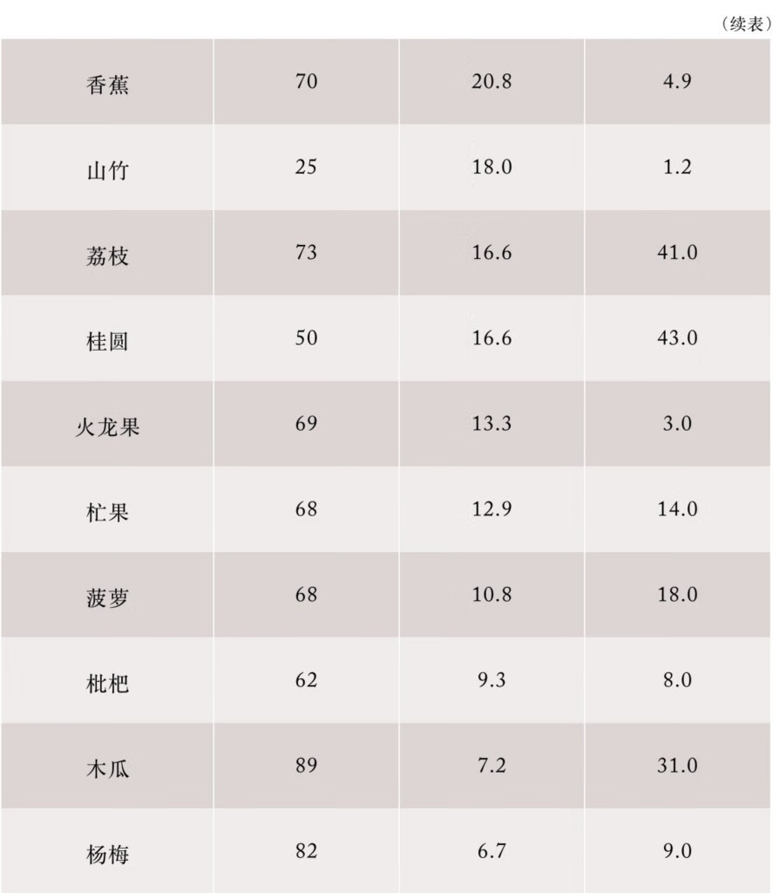

相较于含糖量，我们更应该关注总的食用量。总量一天500克左右的话，一次别吃太多，无论吃高糖水果还是低糖水果，都很健康。了解常见水果的分量，就可以灵活组合，个头比较大的，每天吃一样就能满足需求，比如西瓜、哈密瓜、火龙果、大一些的苹果。而个头比较小的，吃两种也可以轻松满足摄入量需求，比如一个猕猴桃，搭配一个橙子或者一盒蓝莓。

葡萄干、桂圆干、干红枣经济实惠，都是家中的日常食材，适合搭配酸奶，用于面点制作、煮粥等。冻干水果价格较高，一般用来做小零食，比其他膨化食品更健康。

如果配料表里有白砂糖，就是在脱水处理之外添加了糖等物质，就没那么单纯了。这样的情况并不少见，去超市买冻干水果时查看一下配料表，可能就会发现“惊喜”哦。

不建议将水果榨成果汁，这个过程会使水果中的营养成分与氧气充分接触，维生素、具有抗氧化能力的植物化学物容易被氧化破坏。如果需要滤渣，那么滤渣的过程还会去除膳食纤维，造成重要营养的损失。喝果汁时，被榨出的游离糖也会集中进入血液，造成较大的血糖波动，不利于健康。

酥脆的香蕉片、脆枣等都是油炸食品。这些水果是在真空环境下通过低于100摄氏度的油慢炸脱水的。成品、色泽、风味都不错，还能保持原有的形态不收缩。

这也是为什么香蕉、脆枣等食材原本脂肪含量极低，而香蕉片、香酥脆枣的营养成分表中，脂肪含量往往会高于25%。

还有一种处理水果的方式也十分不健康，那就是在一定浓度的糖溶液、盐溶液，或者糖、盐、酸溶液中浸泡、煮制，利用渗透原理让果肉细胞内外的液体交换，把水果中的水分置换出来，让糖、盐等物质钻进去，改变质感和风味。而糖、盐达到一定浓度时，本身就具有防腐的效果。很多果脯、蜜饯都会采用这种方式，比如蜜枣、猕猴桃干、杧果干、梅干等，糖多钠含量高，非常不健康。

# 亦敌亦友的脂肪

《中国居民膳食指南（2022）》推荐，每人每天适宜的烹饪油摄入量为25～30克（2.5～3白瓷勺的量）。但调研数据显示，经常在外就餐的人的油脂摄入量基本上都超过50克，偏好重口味的人每日脂肪摄入量逼近80克甚至更高。若经常这样超量摄入脂肪，那么长胖几乎是逃不掉的了。

食品加工行业里常常需要用到这样饱和程度高的油脂，以减少氧化、延长食品保质期。所以在超市里的饼干、蛋糕、油炸食品的配料表里，常常能看到棕榈油。这是食品加工业中使用量最大的油。

饱和脂肪酸含量高的油，在常温下就会呈固态，比如猪油、牛油、黄油、椰子油、棕榈油。

食物中的单不饱和脂肪酸主要是油酸，橄榄油、菜籽油、牛油果、蛋黄、巴旦木等食物都含有大量单不饱和脂肪酸。

饱和脂肪酸摄入过多会对心血管健康造成危害。世界卫生组织建议每天饱和脂肪酸摄入量占比应限制在全天总热量的10%以内，如果存在血脂异常，摄入量应限制在7%以内。

有大量研究数据显示，食用单不饱和脂肪酸含量较高的油，可以让心脑血管更加健康。如果经常在外就餐，单不饱和脂肪酸的摄入就会比较有限，家里可以选择用低芥酸菜籽油炒菜，增加单不饱和脂肪酸的摄入量。

每周吃1～2次深海鱼虾，凉拌菜食用亚麻籽油，会让脂肪酸摄入更加平衡，更有利于健康。

人工反式脂肪酸对健康没有任何益处，不仅导致肥胖，还会增加患冠心病等心血管疾病的风险，甚至可以通过母乳进入婴儿体内，影响孩子的健康。我们可以尽量避免摄入，离它们越远越好。

反式脂肪酸摄入量高，会使全因死亡风险增加34 %，死于冠心病的风险增加28 %。[2]也因此，世界卫生组织建议，反式脂肪酸所提供的能量，要低于膳食总能量的1%，如果总摄入量在200千卡，就要少于2克。

深加工食品常会用到人造奶油、植物黄油、代可可脂、起酥油等，它们有些在生产时会用到氢化工艺（当然有些起酥油也会用到脂化等其他工艺，以此降低反式脂肪酸含量），使用这些油脂制作的各式各样的饼干、蛋糕、小甜点，以及孩子们爱吃的薯条、炸鸡、冰激凌，就很容易含有反式脂肪酸。

根据我国《预包装食品营养标签通则》的规定，产品每100克或每100毫升的反式脂肪酸含量小于等于0.3克，可标注反式脂肪酸含量为零。可如果我们高频次、大量地在日常饮食中选择这些深加工食品，那么反式脂肪酸摄入量依然有可能超过红线。

如果炒菜做饭时总是用很多油，那么我们会从这些高油脂饭菜中摄入更多的反式脂肪酸。如果习惯把油烧到冒油烟再炒菜，或者经常食用煎炸食物，那么反式脂肪酸的总摄入量会更高。

表2-27　不同油脂解析

* 数据来源：《中国食物成分表（标准版）》第一册、第二册。

* 稻米油、花生油、香油中脂肪酸较为均衡。

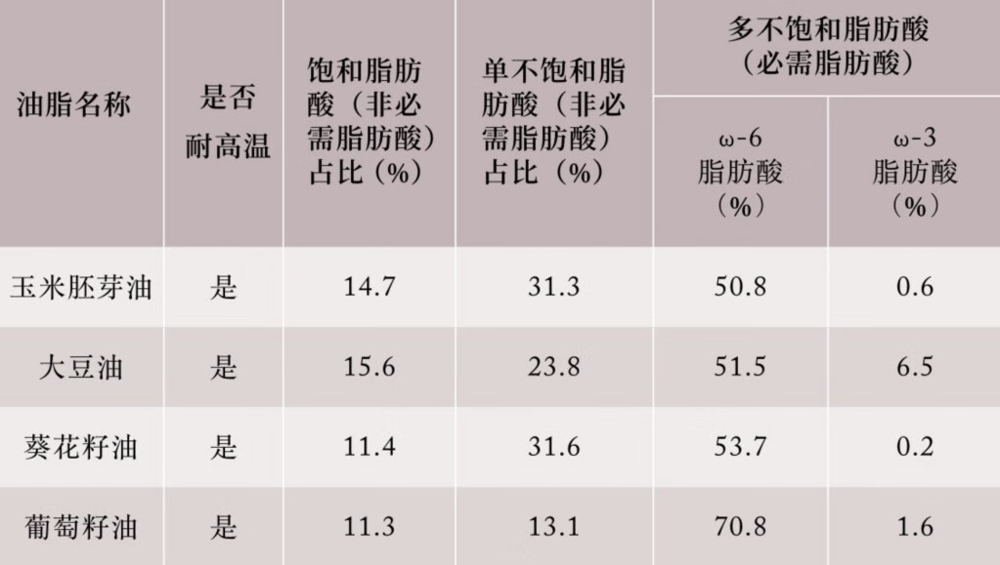
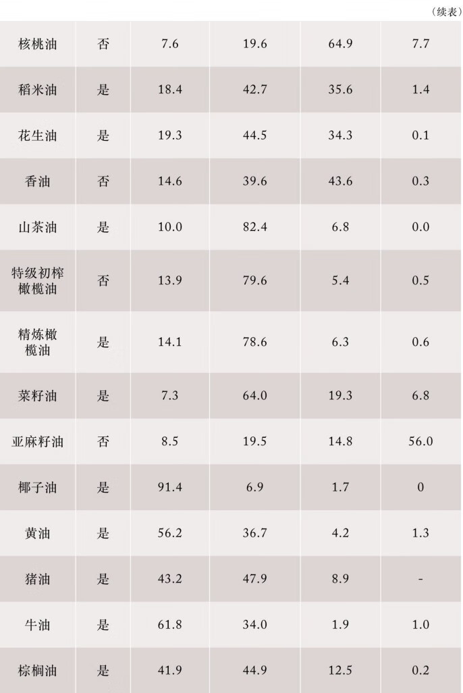

表2-28　不同用途油类推荐及解析

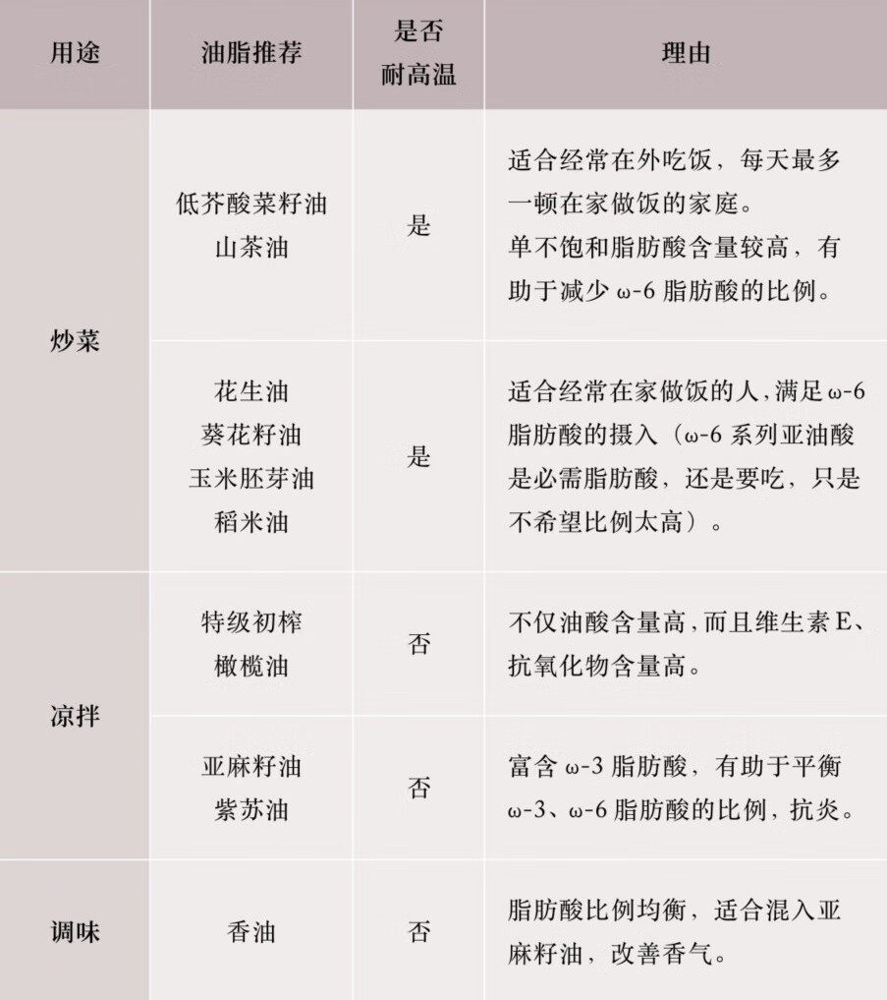

油脂特别容易氧化酸败，从而产生有害物质，尤其是放置在温度较高的炉灶旁，以及阳光可以晒到的地方时。开封半年以上还没吃完的油，可以考虑丢弃。

将油放置在做饭时方便取用的柜子里，不仅可以避光存放，而且可以避免油太快氧化酸败。我的做法是在灶台下方的柜子里安装拉篮放油、调味品，并远离炉灶。

# 好吃又有营养的坚果

《中国居民膳食指南（2022）》推荐，每周50～70克坚果即可，平均每天10克左右，差不多8～10粒巴旦木。一份坚果，相当于半份油脂，所以如果吃多了坚果，烹饪油就可以适当减量。

表2-29　每100克坚果脂肪酸数据汇总

* 数据来源：《中国食物成分表（标准版）》第一册。

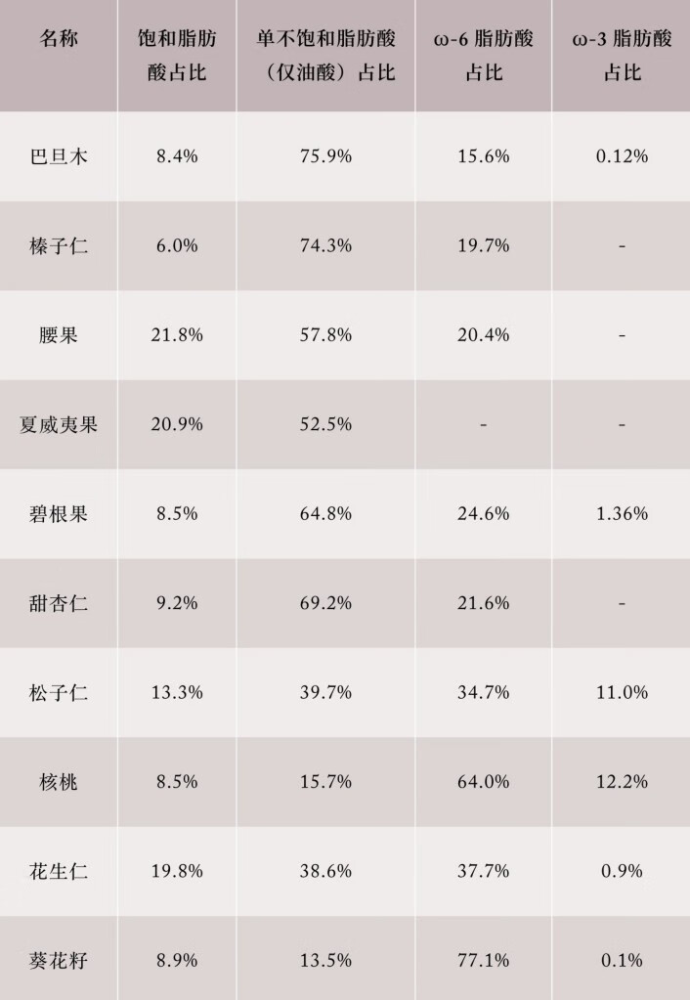

市售坚果怎么选？

●查看营养成分表，钠这一栏的数值尽量为0或很小。

●配料表最好只有坚果，尽量不要有白砂糖、植物油、盐。

●产品类别尽量选择烘烤类，而不是油炸类坚果。

●不要选择裹有脆壳、糖衣的坚果。

当坚果放久了，这些油脂会在氧气的作用下酸败分解，产生油哈喇味，不仅味道变差，营养价值也变得更低。每次少买一些、买小包装的，或者用保鲜罐、干燥剂包来隔绝氧气、防潮，都有助于尽量减慢氧化速度，保持坚果新鲜。

如果买了一大袋或者一大罐，用这一大袋的总克数除以10～15，这个结果便是适合食用的天数。

# “211法则”下的万能食谱

表3-1　“211饮食法”的框架表格

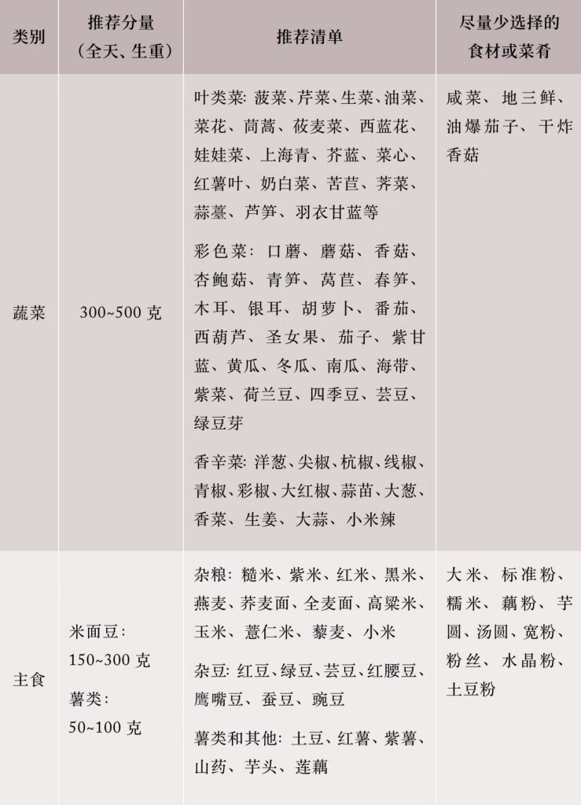
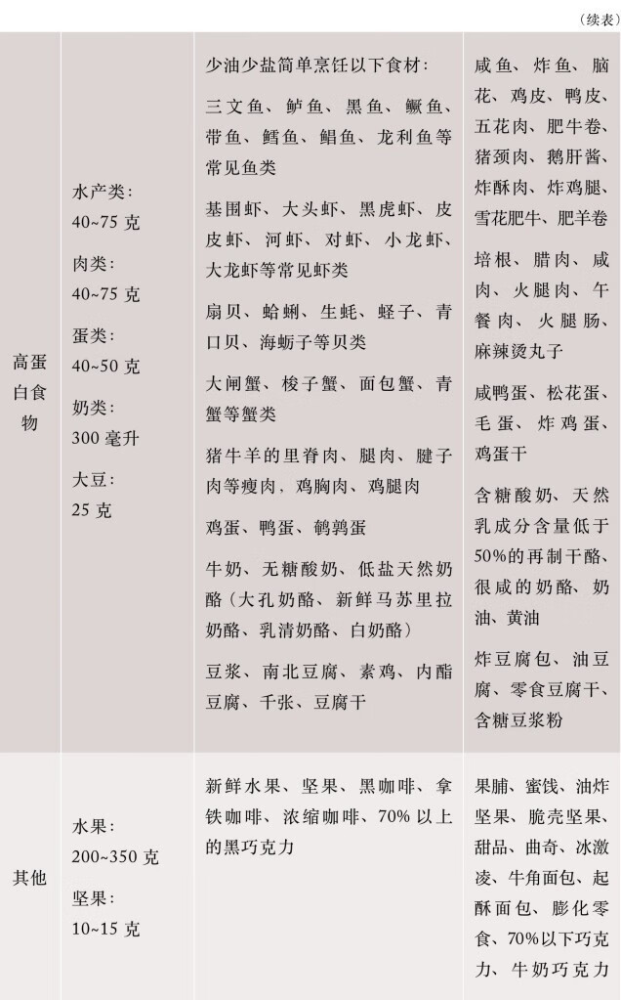

用万能食谱组合一餐，逻辑非常简单。

第一步：先选择占主导位置的高蛋白类食材，比如选择一种鱼或虾，或是某种肉。

第二步：看选好的肉类食材搭配什么蔬菜更适合。想要完成这一步，可以凭借以往的经验，也可以通过相关App查看食谱寻找灵感。

第三步：看看搭配好的菜式里是否含有土豆、莲藕、山药、玉米等可以作为主食的食材，如果有且分量足够就不需要额外做主食了，如果没有或者分量较少，再考虑搭配适量的主食，可以选择杂粮饭、杂粮粥、荞麦面、煮玉米等。

实际应用举例：

●早餐时间紧，选择煎鸡蛋（1个）、煎三文鱼（100克），同时煎一些口蘑（50克），主食搭配杂粮粥。

●午餐时荤菜食材选择猪里脊（80克），搭配蔬菜选择蒜薹（150克），大蒜适量，主食选择杂粮饭。

●全天高蛋白食物还差大豆，那么晚上选豆腐。全天蔬菜还不够，可以用娃娃菜（150克）、胡萝卜（30克）、木耳（50克）补齐，和豆腐搭配。主食选择荞麦面（或者玉米）。

●如此安排完之后，上午加餐选择拿铁咖啡（含牛奶）加坚果，下午加餐选择水果和酸奶，全天就安排妥当啦！

# 水，成就美味的双刃剑

解冻速度越快，细胞内水分流失越严重，食材口感越差。而用科学方法慢慢解冻，可以尽量减少水分流失，让食材恢复原样，保持风味。比如，头一天晚上提前从冷冻室拿出来放到冷藏室，在冷藏室的低温下缓慢解冻。这样做既能保持口感，又能避免细菌大量繁殖，让食物营养、美味、卫生。

食材要先洗后切。如果蔬菜水果切完后再去用水洗，大量营养物质就会从切面随水流失，味道也大打折扣。

烹饪时，食材外围的水会瞬间降低锅内烹饪温度，导致烹饪时间延长。出水增加的话，菜就不好吃了。凉拌时，蔬菜外周的水分也会融入凉拌汁，使风味变淡。

蔬菜清洗完毕后，放在蔬菜筐中沥干水分，等待下锅。使用蔬菜甩干篮效果更好。煎炒大块的鱼、肉等食材时，要用厨房纸巾擦去表面的水分。这样既可以避免因为水遇油而出现迸溅的危险，又可以使食物迅速抵达烹饪温度，缩短烹饪时间。

# 温度与时间，决定了营养与风味

“急火快炒”“小火慢炖”，便点破了温度与时间的关系，即烹饪时间和温度的协作决定了营养流失率。温度高，就得缩短烹饪时间，温度低烹饪时间就得长一些！

# 开启“厨房革命”，让生活健康又高效

养成规划饮食的新习惯，尽量不让冰箱里的新鲜食物隔周存放。

鸡蛋、蔬菜等表面可能携带微生物的食物，最好在固定区域存放，而不要随意乱塞。按固定区域存放不同类型食物，还能让你对食物储存状况了然于心，避免因为忘记而重复购买，从而造成食物和金钱的浪费。

粮食、豆类、坚果、干制香料都怕潮，所以在南方生活的朋友可能更得留意。可以利用密封夹或者密封罐等工具储存，并放置在干燥、阴凉的柜子里。

在大家的印象中，食用油应该没那么容易坏，好像不会发霉、不会腐烂、不会浑浊。但油脂其实很容易坏，而且是静悄悄地坏。因为紫外线、高温等环境会促进脂肪酸氧化，所以将烹饪油放在光照充足、温度较高的环境中，就会加速它的变质，其营养价值和风味都会改变。

在大家的印象中，食用油应该没那么容易坏，好像不会发霉、不会腐烂、不会浑浊。但油脂其实很容易坏，而且是静悄悄地坏。因为紫外线、高温等环境会促进脂肪酸氧化，所以将烹饪油放在光照充足、温度较高的环境中，就会加速它的变质，其营养价值和风味都会改变。

倒入小油壶里的油，尽量在1～2周内用完。大桶的油，尽量在3个月内用完。开封后的油（尤其是放在灶台边上的油）如果过了半年还没有消耗掉，那么为了健康，建议还是丢弃吧。

倒入小油壶里的油，尽量在1～2周内用完。大桶的油，尽量在3个月内用完。开封后的油（尤其是放在灶台边上的油）如果过了半年还没有消耗掉，那么为了健康，建议还是丢弃吧。

日常生活中，很多家庭会将调味品放在灶台边，方便烹饪时随手取用。如果你家就是这样，那么下次烹饪时用手贴着调味品的瓶子感受下温度。如果发现温度很高，可就要注意了！

在这样的环境中放置调味酱料，其保质期会大幅缩短，而且很容易变质。特别是未添加任何防腐剂，或者是脂肪、氨基酸含量较高的调味酱料，更容易变质。

日常生活中，很多家庭会将调味品放在灶台边，方便烹饪时随手取用。如果你家就是这样，那么下次烹饪时用手贴着调味品的瓶子感受下温度。如果发现温度很高，可就要注意了！

在这样的环境中放置调味酱料，其保质期会大幅缩短，而且很容易变质。特别是未添加任何防腐剂，或者是脂肪、氨基酸含量较高的调味酱料，更容易变质。

像蚝油、海鲜酱、辣椒酱、剁椒酱、沙拉酱、拌饭酱、番茄酱等，开封后都要放冰箱储存。

像蚝油、海鲜酱、辣椒酱、剁椒酱、沙拉酱、拌饭酱、番茄酱等，开封后都要放冰箱储存。

# 食材处理要得当，不能越洗越脏

肉的脏，并不像蔬菜表面残留着泥土或农药那样，而是肉眼看不见的微生物。要洗的话，也千万不能用流水冲洗肉。当我们像洗水果蔬菜那样用流水冲洗肉类时，随着水花的飞溅，肉上的细菌就会扩散至水池、操作台、餐具上，甚至会污染其他食物。

中央电视台的一档节目里曾做过一个实验来验证这个问题。远红外线镜头下，在用流水冲洗肉时，细菌飞溅污染的程度非常广，远远超出了我们的想象。

如果你买的是塑封盒装肉，那么这些肉本身很干净，肉表面的细菌也会在加热烹调的过程中被杀灭，烹饪前无须清洗。如果你觉得从菜市场买的肉会比较脏，那么买回来后可以放在水盆中轻柔地清洗，并妥善处理好洗肉的污水，及时清洗水盆。

肉的脏，并不像蔬菜表面残留着泥土或农药那样，而是肉眼看不见的微生物。要洗的话，也千万不能用流水冲洗肉。当我们像洗水果蔬菜那样用流水冲洗肉类时，随着水花的飞溅，肉上的细菌就会扩散至水池、操作台、餐具上，甚至会污染其他食物。

中央电视台的一档节目里曾做过一个实验来验证这个问题。远红外线镜头下，在用流水冲洗肉时，细菌飞溅污染的程度非常广，远远超出了我们的想象。

如果你买的是塑封盒装肉，那么这些肉本身很干净，肉表面的细菌也会在加热烹调的过程中被杀灭，烹饪前无须清洗。如果你觉得从菜市场买的肉会比较脏，那么买回来后可以放在水盆中轻柔地清洗，并妥善处理好洗肉的污水，及时清洗水盆。

鸡蛋最好放置于冰箱中的独立区域，拿出来的鸡蛋以及碎掉的蛋壳不要在操作台乱放，摸过鸡蛋的手在洗之前不要摸其他直接入口的食物或餐具。养成这些好习惯，可以很大程度上避免沙门氏菌污染。

鸡蛋最好放置于冰箱中的独立区域，拿出来的鸡蛋以及碎掉的蛋壳不要在操作台乱放，摸过鸡蛋的手在洗之前不要摸其他直接入口的食物或餐具。养成这些好习惯，可以很大程度上避免沙门氏菌污染。

米面、坚果、玉米食物发霉时容易出现一种叫作黄曲霉菌的腐生真菌，它所分泌的黄曲霉毒素在高温下都无法被分解，是有名的致癌物。

米面、坚果、玉米食物发霉时容易出现一种叫作黄曲霉菌的腐生真菌，它所分泌的黄曲霉毒素在高温下都无法被分解，是有名的致癌物。

如果水果有一部分发霉腐烂，那么最好整个都丢掉，因为没有腐烂的部分很可能已经被细菌所分泌的毒素污染，十分不安全。况且，久置到发霉说明食物已经很不新鲜了，不吃也罢，不要舍不得。如果不想如此浪费食物，最好的方法就是按需购买，努力从一开始就把好关。

如果水果有一部分发霉腐烂，那么最好整个都丢掉，因为没有腐烂的部分很可能已经被细菌所分泌的毒素污染，十分不安全。况且，久置到发霉说明食物已经很不新鲜了，不吃也罢，不要舍不得。如果不想如此浪费食物，最好的方法就是按需购买，努力从一开始就把好关。

如果你买来的胡萝卜、土豆、红薯、莲藕等食材上面带有较多的泥土，那么不要分散着直接放入冰箱，以免泥土中的细菌微生物对冰箱里其他食物造成污染。可以先用厨房纸巾把泥土擦干净，然后装入保鲜袋，或者用水清洗后将表面水分擦干、晾干，再放进冰箱。再或者，直接放在室内阴凉通风的环境中储存。

如果你买来的胡萝卜、土豆、红薯、莲藕等食材上面带有较多的泥土，那么不要分散着直接放入冰箱，以免泥土中的细菌微生物对冰箱里其他食物造成污染。可以先用厨房纸巾把泥土擦干净，然后装入保鲜袋，或者用水清洗后将表面水分擦干、晾干，再放进冰箱。再或者，直接放在室内阴凉通风的环境中储存。

# 炒菜的方法该迭代了

而现在的精炼油杂质非常少，烟点也比原来高，如果等到冒烟时再下锅，油温就已经很高，不仅容易产生有害物，而且容易煳锅。

●先把锅烧热，再加入油，然后直接开始炒菜。也可以在油锅中放入一片生姜或蒜片，待周围开始微微冒泡时就可以炒菜了。

●选择锅体或锅底比较厚的锅具，避免油温上升过快以及受热不均匀。

●安装吸力强的抽油烟机，开始炒菜时就打开油烟机，炒菜结束后再继续抽几分钟，保证还没有充分燃烧的废气和油烟都被吸走。

●除了炒菜，还可以交叉采用蒸、煮、炖、凉拌等烹饪方法，减少油烟出现的可能。

芥蓝、菜心、西蓝花这些叶片较大或者有点块头的蔬菜，在炒制时接触锅底的面积较小，想要受热均匀就比较难。等炒到全熟又容易烹饪过头，花费的时间也较长。而用水焯的话，只要几十秒蔬菜就断生了！

豆角、芸豆、鲜黄花菜等食材含有容易导致人食物中毒的植物血凝素，炒菜前可以先用沸水煮2～3分钟，捞出后再搭配其他食材炒，安全、好吃又方便。

快速焯煮蔬菜，可以杀灭蔬菜表面的细菌，去掉一些农药残留，同时通过溶解去除一部分影响矿物质吸收的草酸、植酸、鞣酸等成分。焯煮还可以大幅缩小叶类蔬菜的体积，帮助我们一顿吃掉更多的蔬菜。

所以，合理焯烫蔬菜，可以吃得便捷又营养。

蔬菜焯烫技巧时间：焯烫青菜时，要等水沸腾再让菜下锅，等叶片一变软、变色就可以马上捞出，然后平摊开帮助蔬菜迅速散热。这个过程短则十几秒，一般不要超过1分钟，豆角等蔬菜除外。水量：焯水时也不必使水没过蔬菜，水越多，所需的煮沸时间越长。早上准备一人份蔬菜的话，往平煎锅内加半杯水就行，水沸后放入蔬菜盖上锅盖，以半蒸半煮的方式也可以将蔬菜迅速烹熟。技巧：提前加半勺油可以使蔬菜纤维更柔软，口感更好，颜色也会更加翠绿。水中加少量盐或者酱油，能让菜更有味道。风味：煮完的青菜直接吃多半是不好吃的，所以调味很重要。常见的香油、酱油、蚝油、醋，甚至有些调味酱（牛肉酱、芝麻酱、辣椒酱），都可以用起来。好吃的酱汁能让蔬菜更美味，不过要注意别太咸。

如果蔬菜量比较大，可以分几次焯煮，避免一次性放入过多蔬菜导致锅内温度骤降，延长烹饪时间（这一点同样适用于炒菜）。

蔬菜的重要使命，就是为我们提供大量的维生素、矿物质、抗氧化物、膳食纤维、植物化学物等。这些营养物质中很多都比较脆弱，容易在烹饪过程中损失掉，以生熟参半搭配的方式摄入蔬菜是更恰当的安排。

如果想尽量保留蔬菜中脆弱的营养素，那么有些细节还是要提醒你注意的。做炖菜、烩菜、蔬菜粥、蔬菜面等食物时，绿叶菜要最后放，搅拌几十秒即可离火，避免过度烹饪。涮火锅时不要一股脑把蔬菜丢进去，一边慢慢煮，一边慢慢捞，而是要现吃现烫，或者一次性多烫一些，一分钟左右就捞出，放在一个干净的碗盘里，供大家分享取用。

常用的烫蔬菜调味汁1　经典咸辣酱汁原料：

葱、蒜、小米辣、酱油、醋步骤：

1．将葱、蒜、小米辣切碎；

2．倒入少量酱油、醋搅拌均匀；

3．腌制1～2分钟出味后，淋到蔬菜上即可。2　香菜柠檬酱原料：

香菜、柠檬、酱油、香油步骤：

1．将香菜、柠檬果肉切碎；

2．倒入少量酱油拌匀后滴入香油；

3．腌制5～10分钟后，直接淋到蔬菜上。3　芝麻香醋酱汁原料：

芝麻酱、酱油、醋、香油、芝麻步骤：

1．取2汤匙芝麻酱，加入少量水搅拌均匀；

2．加1汤匙酱油、1/3汤匙醋继续搅拌，然后滴上几滴香油；

3．调制好后，淋到蔬菜上，再撒上少许芝麻点缀。

# 肉，做法恰当才好吃

需要注意的是，肉中所谓的血水并不是什么脏东西，它的主要成分是肌红蛋白，我们也会称之为肉汁。饱含肉汁是肉维持软嫩口感的秘密，就像橘子被挤掉汁一样，肉汁流失使肉变得干柴，不好吃。冷冻肉最好放冷藏室缓慢解冻，让细胞缓慢吸收肉汁，避免冰晶刺破细胞导致肉汁流失。

肉中的B族维生素容易被破坏，比如维生素B1、B2、B12。炖牛肉、卤牛肉需要较长时间，对维生素的破坏较多，而烤厚牛排、涮肉烹饪速度快，对维生素的破坏更少。

，我们可以选择炖牛肉、卤牛肉之类的方式来制作牛肉，保证蛋白质和铁元素的摄入，同时用涮煮、快炒等方式做牛肉，获得更多重要的B族维生素。尤其是维生素B12，它在植物性食物中含量非常低，我们主要通过肉类来获得。

牛肉几乎没有什么寄生虫，断生就可以吃，烹饪到刚刚变色时吃，口感最嫩，营养素保留率也高！

炒牛肉也是我经常做的菜，秘诀是一定要在配菜都炒熟之后放肉片，这一点与炒猪肉的常规方法正好相反。想让牛肉更嫩的话，还可以提前用一颗鸡蛋的蛋清或者放少许淀粉抓匀（这些是加分项，没有这一步肉一样好吃）。我会先把洋葱炒熟，然后把牛肉片放入锅中迅速翻拌，一旦变色就马上调味准备出锅，一般不超过1分钟。除了洋葱，我还搭配过青椒、番茄等蔬菜，味道都很好。

猪肉：相较而言，猪肉的脂肪含量高，与蔬菜同炒时，适合先下锅炒出香气，再加入蔬菜同炒，或者将肉炒至七成熟时盛出来，待蔬菜炒至五成熟，再将肉倒入一同炒熟。猪肉存在寄生虫的风险，生吃或没完全做熟时，肝脏或脑部可能会寄生钩绦虫，所以应完全炒熟。

鸡肉：鸡肉适合与水分含量较高的蔬菜一起炒，先将蔬菜炒出汁水，然后倒入鸡肉，用锅内的汁水将鸡肉焖熟或者烩熟，这样肉质会更嫩。鸡肉容易携带有致病性的沙门氏菌，所以也必须充分炒熟才可以。

牛肉：牛肉与蔬菜同炒时，适合先将蔬菜下锅炒热，再加入牛肉，牛肉变色即可出锅，避免因为加热久了牛肉口感变硬。牛肉几乎不会有寄生虫，所以煎牛排时甚至可以吃三分熟。

# 做饭想偷懒？学学合理备餐

预制主食冷冻储存，从营养和时间性价比上来说，都是很划算的！

不过，做好的主食要记得放冷冻室，而不是冷藏室。主食中的淀粉在0～4摄氏度的冷藏温度下会发生老化，口感会变差，复热也很难恢复口感，但直接冷冻的话，淀粉老化的现象就不明显。从冷冻室取出后直接用微波炉加热，或者再蒸熟，都可以较好地恢复口感。

主食备餐方法

●一次性蒸好的馒头放冷冻室保存。可以做杂粮馒头、牛奶南瓜馒头、红枣馒头等，换着花样增加营养。

●蒸米饭可以一次性多蒸一点，按照70～100克（生米）为一份来划分，比如蒸了400克米，可以划分为4～5份。蒸好之后按份分装放入保鲜盒，冷冻储存。

●提前蒸煮红薯（紫薯）、玉米，分装放冷冻室里。

绿叶类蔬菜本身就很娇嫩，叶片大，水分也容易蒸发流失。如果烹熟再储存，营养损失更大，还容易产生一定量的亚硝酸盐。而且它们烹饪起来很快、很方便，沸水煮半分钟到一分钟即可捞出调味。所以，绿叶类蔬菜不适合提前备餐，也完全没必要。

关于蔬菜储存，建议只做简单处理，不要洗切。如果要洗切，装袋时就需要将水分吸干，否则更容易坏，反倒更麻烦。

番茄适合室内低温储存，大约在10摄氏度即可。如果是夏天，放冷藏室或常温储存都不合适。如果是用来做菜而非生吃，那么不如洗净擦干，直接冷冻。使用时也不需要完全化冻，切开即可烹饪，还能保证新鲜多汁。

综合来看，肉类、水产类也适合提前备菜。而蛋、奶、豆比较简单，都可以直接拿来食用。

尽量合理规划饮食，头一天晚上把第二天要用到的食物拿到冷藏室，让它们在低温下缓慢解冻。速度越慢，营养素保留率越高，口感越好。解冻不得当的话，食材的口感就会变得很差。切忌用热水解冻，不然营养及风味损失较大。

●肉可以提前炒好、烤好、卤好，冷藏保存可以吃2～3天，不建议冷冻。

# “百味之王”——盐的使用和挑选

但是，盐确实不能多吃。中国营养学会、世界卫生组织都建议健康成人每天的食盐（包括酱油和其他食物中的食盐）摄入量不应超过5克，[1]盐摄入超量也会引发一系列健康问题。但截至2020年的调查数据显示，中国人均烹调用盐摄入量为9.3克，[2]几乎翻倍了。

高血压流行病学调查证实，人群的血压水平和高血压的患病率均与食盐的摄入量密切相关。

烹饪会用到很多调味品，而这些调味品中绝大多数都含有盐。像酱油、蚝油、蒸鱼豉油、鸡精、辣椒酱、豆瓣酱、黄豆酱、咖喱料、浓汤宝等，统统含有盐。

在烹饪时，如果需要放各种酱料，那么每一种少一些，组合起来就已经有很多盐了，往往不需要另外单独加盐。

咸鱼、火腿、咸肉、腊肉、咸菜、泡菜、腌菜等腌制食物，都是高盐食品。食材本身吸收了大量的盐，吃起来也确实非常咸。腌制肉不仅盐含量高，而且亚硝胺等致癌物含量高，这使得世界卫生组织把这些腌制加工肉评定为一类致癌物。

# 五花八门的酱油醋

根据氨基酸态氮的含量，我国酿造酱油的等级设置如下[1]：

特级：氨基酸态氮≥0.80克每100毫升

一级：氨基酸态氮≥0.70克每100毫升

二级：氨基酸态氮≥0.55克每100毫升

三级：氨基酸态氮≥0.4克每100毫升

三级酱油品质比较低，一般只适合加热烹饪，不适合凉拌佐餐。

# 健康酸味的来源

维生素C在高温下易被氧化，但在酸性条件下比较稳定。所以，烹饪时加醋可以对维生素C起到一定的保护作用，减少维生素C在高温下的损失。不过要注意，烹饪绿叶类蔬菜时不适合提前加醋，否则叶绿素在醋酸的作用下会丢掉镁离子，导致叶片变黄。如果要加，开吃前淋上即可。

烹饪土豆等食材时，适量用醋可以保持脆的状态。这是因为植物细胞壁含有果胶，加了醋之后，果胶在酸性的环境中能保持更久，使得蔬菜更脆。

食醋中的有机酸还会和鱼、羊肉等食材中产生“腥味”的胺化物发生反应，达到烹饪去腥的目的。甜味会削减盐所带来的咸味，而醋正好相反，可以增强咸味，帮助我们减少盐的摄入量，避免血压升高和肥胖等。

醋可以刺激胃酸的分泌，促进消化并提升食欲。在凉拌菜中放些醋，有机酸还能抑制有害细菌的生长，提高凉拌菜的安全性。

对于人体而言，由于食醋能够延缓胃排空的速度，葡萄糖进入血液的过程自然也随之延迟，餐后血糖波动幅度较小。将食醋加到食物中，可以降低食物的GI（血糖生成指数）值，使受试者的餐后血糖水平下降。

在西餐中，经常会用柠檬为海鲜调味，祛除腥味、异味；东南亚菜则直接用它入菜，以凸显菜肴天然的酸甜味道；中国南方地区的烤鸭、烧鹅中，也少不了柠檬这一调味品。

# 糖是甜蜜，更是负担

烹饪时用糖大致有三个目的，第一个是增加甜味，第二个是辅助提鲜，第三个是让糖在高温下发生美拉德反应，产生焦糖色和焦香风味。

世界卫生组织建议成人每天添加糖摄入量尽量控制在25克以内，[1]这些高糖菜肴自然少吃为妙。而且，如果想要用于提鲜，只需要少量糖就可以做到。

红糖含有95%左右的蔗糖，保留了甘蔗中的较多矿物质、植物色素等成分，相较于白砂糖，营养略微多一些，含有少量苹果酸、核黄酸、胡萝卜素、烟酸以及铁、锰、锌、铬等矿物质。但是这些所谓的营养，跟其他食物比起来还是太少了。本来糖的食用量就要控制，所以红糖能提供的营养物质更是有限，甚至可以说是贫瘠，起不到什么补充营养的作用。

蜂蜜主要由葡萄糖和果糖构成。很多人觉得蜂蜜有“润肠通便”的效果，这并不是因为蜂蜜促进了肠道功能改善，而是因为肠道对果糖的吸收能力较差，消化不掉的果糖堆积在肠道中，提升了肠内渗透压，从而刺激肠道加速运动和聚集水分，最终引起便意，造成了轻微腹泻而已。

如果实在想吃甜味，可以适当选择带有甜味的天然食材。在烘焙或蒸面点时，可以选择用香蕉、红枣、葡萄干等替代白砂糖，它们在带来甜味的同时，还可以带来维生素、矿物质、有机酸、膳食纤维等营养物质，性价比更高。

# 辣味吃对了也健康

选择配料表简单的产品，可以帮助我们在满足个人口味需求的同时吃到更加有品质的辣椒酱。

# 中式烹饪香辛料，提升锅气的好味道

特别提醒，中式烹饪中经常用“大蒜炝锅”，这种方式确实可以使蒜香散发，但是注意温度不要过高。大蒜被烧煳不但会破坏大蒜素，还会产生致癌物质丙烯酰胺。[2]为了健康好味道，低温炒香就好。

常见的洋葱有以下几种。

●紫洋葱：味道辛辣，适合炒菜及炖煮。

●白洋葱：味道较淡、偏甜，适合做凉拌菜，味道清爽。

●小洋葱头：生葱头有点呛，但是并无太大的辛辣味，在国外菜品中较常见，尤其是泰式料理。

八角与洋葱一起煮会产生另一种有芳香气味的物质，煮肉时同时加入八角和洋葱，就会提升肉的风味。

# 芝麻酱、芝麻油，提升颜值和风味的好帮手

超市里的黑芝麻酱大多会添加白砂糖来调味，购买时一定要提前看下配料表。如果实在没有无添加的黑芝麻酱，就重点关注碳水化合物这一栏，数值越低越好。

1．想要选到好的白芝麻酱，可以尽量挑选颜色较深的。芝麻酱的制作工艺比较传统，小品牌、小磨坊也有好酱。

2．纯芝麻酱成本较高，略有苦味。所以不少芝麻酱都会混合一定量的花生酱、瓜子酱来调整成本和风味。如果想买香浓的纯芝麻酱，一定要看配料表信息，或者询问店家。

3．芝麻酱放在瓶子里时间长了会分层，上面是油，下面是厚实的酱。所以油层析出越少的芝麻酱，生产日期越近。

芝麻油的制作方法有很多种，有水代法、机榨法、精炼法等。小磨香油所用的水代法是最传统的制作工艺，利用油与水的比重不同，从而将香油与其他渣滓分开。水代法制作的香油也是风味最好的香油，如果是使用了这种方法制作，在包装上一般都会说明，在购买的时候可以留意一下生产方式这一栏。

# 纯天然番茄酱——厨房必备

购买番茄酱的技巧：

●如果配料表含有较多白砂糖、葡萄糖浆等添加物，往往口味较甜，可直接食用，是用来蘸食的酱料。由于含糖量比较高，尽量少食用或不食用。

●如果配料表含有食盐，甚至洋葱、大蒜、罗勒叶等香料成分，这种是用来搭配意大利面的番茄酱。如果含盐量不高，也可以用作酱底，再搭配新鲜的瘦肉糜、洋葱、番茄丁，做成一份新鲜的意大利面酱，搭配意大利面或者米饭来吃。

●如果配料表中只有番茄，或者有少量食品添加剂，这种就是没有被调味的天然番茄酱。做番茄炒蛋等番茄味料理时都可以用来增色、增味、增营养。

# 咖喱，百变的异国风味

如果觉得好吃又方便，偶尔做几回咖喱口味的料理也无妨，但我不推荐为了方便而长期食用这种富含饱和脂肪酸的深加工复合调味品。

# 养成吃杂粮饭的好习惯

●无须浸泡：精大米、胚芽米、小米、燕麦米、生燕麦片、绿豆、藜麦、小粒玉米糁、玉米面

想要快速煮粥、煮饭，可以选择它们进行组合搭配。

●需提前浸泡0.5～2小时：糙米、紫米、黑米、红米、荞麦

短时间浸泡即可有较好的口感，如果电饭煲有杂粮烹饪功能，也可以直接烹煮。

●须提前浸泡4小时以上：红豆、芸豆、腰豆、薏仁、鹰嘴豆

需要长时间浸泡，才能在烹煮后得到较好的口感，一般建议放入冰箱浸泡过夜。

# 简单省事的彩虹烤蔬菜

彩虹烤蔬菜（2人份）食材

土豆 ..............................................200克

西葫芦 ............................................80克

西蓝花 ............................................80克

菜花 ..............................................80克

洋葱 ..............................................50克

彩椒 ..............................................50克调味品

烹饪油 ...........................................15克

盐 ...............................................2克

孜然粉、五香粉、辣椒粉.............................混合适量步骤

1．将食材切或掰成小块，装进保鲜袋内，放调味品，密封好。摇晃袋子，让蔬菜和调味品充分混合（土豆单独一包，西蓝花和彩椒为一包，其他蔬菜混合一包）。

2．烤箱预热至180摄氏度，先将土豆放进去烤15分钟。

3．打开烤箱，将洋葱、西葫芦、菜花放进去烤10分钟。

4．将西蓝花、彩椒放进去烤5分钟，所有食材一起拿出。

# 家庭自制高汤，让饭菜更香

按照烹饪方法，高汤可以分为以下几种。

参考食谱自制火锅汤底示范食谱：排骨火锅汤底食材

大棒骨（或排骨）、姜、葱、蒜、八角、小茴香籽、香菇、枸杞子、盐等步骤

1．大棒骨冷水下锅，煮至沸腾，去除浮沫，将大棒骨捞出备用。

2．另烧开一锅水（用铸铁锅、砂锅、高压锅等都可以），放入焯好的大棒骨，同时放入姜、葱、蒜、八角、小茴香籽、香菇、枸杞子等。

3．加入一勺盐，转小火慢炖1个小时。鸡骨架高汤食材

鸡骨架、生姜、小葱步骤

1．鸡骨架斩块，冷水下锅焯1分钟捞出。

2．焯好的鸡骨架、生姜、小葱下锅。

3．加入所有食材3倍的水，用最小火熬煮到只剩下1/3的水。

（如果烤一下鸡骨架，味道就会更好。）

煲汤时不宜中途加水，否则会影响汤的味道，即使中途实在需要加水，也要加开水，而非冷水。一般情况下，水与食材的比例应该达到3∶1。

# 祛腥味，让鱼肉滑嫩好吃

由于鱼肉富含优质蛋白，蛋白质的代谢和腐败所产生的物质也会产生“腥气”，所以越是不新鲜的鱼，腥味越重。鱼身上引起腥味的主要是内脏、鳃、表面的白色黏稠胶状物、贴近鱼脊骨的黑色内膜和带状的血。在处理鱼的时候，这些部位都要处理干净。

腌制去腥步骤：

1．刮干净鱼表面的黏液。

2．均匀地浇淋料酒。

3．将白胡椒粉撒在鱼的表面简单揉搓。

4．姜切片、葱切段，放至鱼腹和鱼鳃内。

5．腌制5～10分钟后即可烹调。

参考食谱酱烧鲈鱼步骤

1．将腌制好的鱼先双面煎制处理，以保证鱼肉不会散碎。

2．重新起锅，将搭配好的姜、蒜、辣椒等调味料炒香。

3．将煎过的鱼放入炒香的配料中。

4．加入少量的水、酱油，以及一点点白糖进行炖煮。

5．出锅时撒上一小把香菜，提味增色。

番茄菌菇鱼片步骤

1．制作调味汤底：将洋葱、西芹、蘑菇、番茄等风味较浓的蔬菜轻微煸炒。

2．加水煮开，加入一包无添加番茄酱（约20克）。

3．将火调小，等水不再沸腾，底部微微有小气泡时，将鱼片放入锅中搅拌均匀，盖上盖子焖10分钟，加盐调味即可。

煮鱼片的最佳温度在80摄氏度左右，或者微微煮开但尚未沸腾的状态。加入鱼片后也要观察温度，避免过度沸腾，只要鱼片颜色变白，鱼肉紧实即可离火。整体来说，鱼片不是被煮熟的，更像是烫熟、焖熟的。如果大火沸水煮鱼，鱼肉不仅容易煮老，还容易把鱼片冲散，菜肴的味道和质感就会差很多。

# 腌制入味，方法恰当才健康

烤鸡翅根食材

鸡翅根、酱油、盐、孜然粉、鲜辣味粉（辣椒、大蒜、生姜等复合调味粉）、烧烤粉、洋葱、香油步骤

1．将鸡翅根装入保鲜袋中，加入10毫升（1汤匙）酱油。

2．加入孜然粉、鲜辣味粉、烧烤粉、少量盐以及洋葱。

3．再加入少量香油，将袋子密封并摇晃，混合均匀后腌制10分钟左右。

4．放入烤箱，180摄氏度烤20分钟。

香煎鸡胸肉食材

鸡胸肉、白胡椒粉、

黑胡椒粉、辣椒粉、

盐、香油、洋葱、尖椒步骤

1．将鸡胸肉切成较薄的大片，装入保鲜袋中。

2．分别加入1/3汤匙白胡椒粉、辣椒粉和黑胡椒粉。

3．加入1/2汤匙的香油、少量盐，并将洋葱、尖椒放入，将袋子密封并通过摇晃混合均匀。

4．往平煎锅中倒少量油，将鸡胸肉片平铺在锅内。

5．两面煎熟后，一盘香煎鸡胸肉就做好了。

# 减肥的终极密码

我们需要做的是，不断地优化饮食结构，让每天所吃的食物中蛋白质、脂肪、碳水化合物的比例逐渐靠近2∶1∶1，在整体减少食量，保证营养素充足的同时，尽量减少总热量。

想通过调整饮食结构减肥时，要遵循的一个大原则就是，尽量选择能量密度低而营养密度高的食物。这样才吃得饱、吃得好，还更容易达到减肥的目标。

# 抗衰老饮食

胶原蛋白存在于动物的结缔组织（比如软骨、筋腱）中，而植物中是没有的。所以，植物胶原蛋白就是单纯的忽悠了。桃胶、银耳熬制后那种胶黏的成分，主要是多糖类，而非胶原蛋白。

有多项研究显示，蔬菜水果吃得比较足量的人，较少生病，寿命也较长。而这些食材都富含大量的天然抗氧化物，可以对抗自由基。

叶类蔬菜的叶片既要捕获阳光进行光合作用从而生成养分，又需要抵抗紫外线所带来的伤害。所以叶片中会聚集大量的植物化学物，起到抗氧化作用。颜色越深，含量越高。推荐每天500克左右绿叶菜，尽量不要过度烹饪，以减少抗氧化物质的损失。

250克左右水果，能提供非常丰富的抗氧化物。跟蔬菜一样，深色水果的抗氧化能力往往高于浅色水果，比如深红色桃肉的抗氧化能力比白色桃肉更高。

只要我们能够保证每天500克蔬菜、250克水果，以及食材尽量新鲜、有品质，就能轻松获得抗氧化物。而它们所带来的效用，比抗氧化保健品要好得多。

在糖化反应中，糖并不是可以吃的那种甜甜的糖，而是特指那些具有还原性的糖，如葡萄糖、半

表4-6　糖的分类

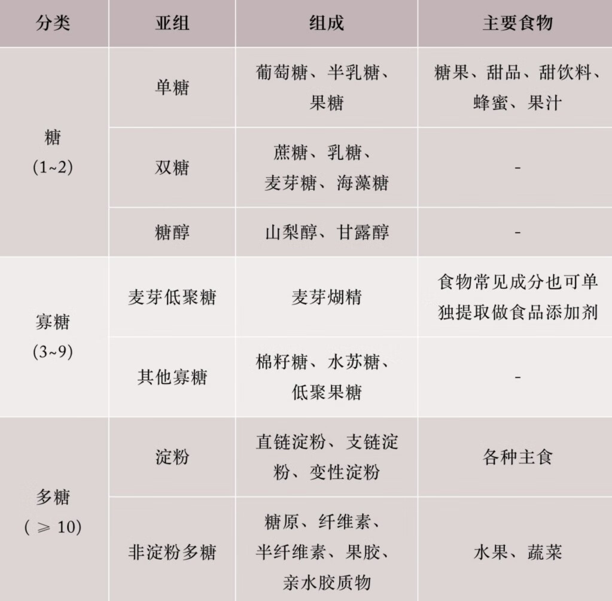

不考虑整体饮食结构，只想靠特定的食物带来美貌，都是方向性错误。

●胶原蛋白不能被直接吃进来，只能由身体自己合成。

●服用抗氧化膳食补充剂并没有实际的抗氧化效用。

●保证每天500克蔬菜、250克水果，减少简单糖的摄入，蛋白质吃够量，适当进行有氧运动，就能获得活性抗氧化物，合成充足的胶原蛋白，达到抗衰老的目的。

# 掌控饮食，从自制便当开始

组合二：主食+高蛋白食物+蔬菜混搭炒饭

三类不同食材混搭的经典做法就是炒饭。

虾仁、鸡肉、牛肉、三文鱼等高蛋白食物，可以切成丁加进炒饭里，蔬菜也可以多加一些，青菜、圆白菜、胡萝卜、长豇豆等都可以选。这样的炒饭不仅营养全面，而且味道很不错。

一人食便当推荐搭配：组合一：蔬菜+高蛋白食物（做菜），搭配任意主食

这个思路适用于大杂烩菜式，既可以蔬菜和肉类同炒，也可以将肉类先焖炖一会儿，然后临出锅时加入易熟的蔬菜。大杂烩菜非常好做，可以加入自己喜欢的肉类和蔬菜，最后搭配一份主食即可。

# 如何吃夜宵也不长胖

健康夜宵大原则：

1．点完菜后随口提醒店家“少油少盐”，很多时候会奏效。

2．出门吃，要吃精品。留意食材品质，能降低重油重盐食物的摄入概率。

3．主动控制频率，这比某一次就餐过程中克制食欲更加重要。

4．吃了大餐后，日常饮食中要重点补充蔬菜。

5．所谓的享受美食，要以吃完后没有负罪感为参考标准。

# 学会照顾孕产妇

备孕时关注易缺乏的关键营养素1．叶酸：预防胎儿神经管畸形

叶酸的补充要从孕前三个月开始，一直持续整个孕期，我国也从2010年开始免费为育龄女性提供每天400微克叶酸。2．铁元素：预防缺铁性贫血

每天吃50～100克红色瘦肉，每周吃1次动物血或25～30克内脏，可以有效补充血红素铁。同时注意新鲜蔬菜、水果的摄入，足量的维生素C有助于铁元素的吸收。如果已经发生缺铁性贫血，可以在医生或营养师的指导下服用铁剂。不建议擅自服用铁剂，因为过量摄入铁元素也会严重危害健康。3．碘元素：预防胎儿神经系统发育异常

碘是合成生长激素的关键元素，碘盐是膳食碘的重要来源，每天不超过5克盐对于备孕的女性是足够的，但对已经怀孕的女性来说，还不够。所以，已经怀孕的女性，每周还需要再摄入1次富含碘的食品，比如海带、紫菜、海苔、海藻等。

# 解决孩子的挑食问题

改善挑食必试法则：

●改变食物的形态、样貌、烹饪方式，让孩子继续尝试。

●将孩子不爱吃的食物逐步、少量地混搭进其他食物中。

●带孩子认识食物原本的样子，比如带孩子去逛超市、去采摘园或让孩子在厨房做小帮手，让孩子熟悉食材的同时拉近与食物的关系。

# “211法则”适用于儿童吗？

1～3岁孩子的胃容量还太小，可以适当改变食物的优先级，优先保证主食和高蛋白食物，不能让蔬果占重要地位。4岁以后，尤其是6岁以后的儿童，其饮食结构就越来越靠近普通成人。

总分量上，7～10岁孩子的主食需求量能达到妈妈食量的2/3，视觉体积比孩子的一拳略大一点。再长大些，青春期的孩子就和成人的主食量一样了，每顿谷物生重70～100克，搭配拳头大小的薯类，就能满足主食需求量，个别身高较高、发育较快的孩子，还可以额外增加一些主食。

孩子的发育需要更多的钙、铁、碘等元素，这些营养素的主要来源是奶类、红肉和内脏、海藻类食物。奶类摄入可以达到500毫升，每周吃1～2次动物血制品、肝脏，每周吃些海带、紫菜等食物更有利于孩子的健康。

# 带孩子认识营养标签

我国《预包装食品营养标签通则》规定，配料表的成分要按照含量多少排序，越往后含量越少。

表4-13　优化食品性状的添加剂

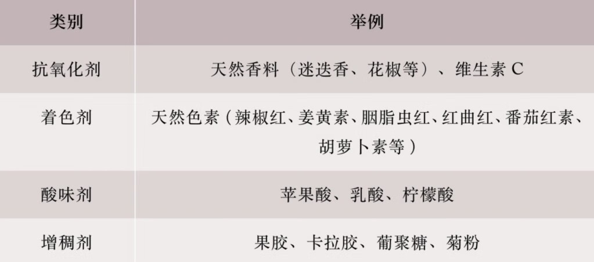

土豆的脂肪含量只有0.2%，而薯片脂肪含量高达33%，“非油炸薯片”也几乎一样。这些脂肪都是在生产制作过程中额外添加的。非油炸薯片聪明地避开了大众嫌弃的“油炸”字眼，而是将油脂混合土豆淀粉和成面团，压成片状再烤制，虽然不是油炸，可脂肪几乎没减少。

钠这个指标，关乎盐的摄入量。盐过量容易诱发高血压、胃癌，是对健康威胁很大的要素。在购买汤料、调味酱、挂面、加工肉、坚果、零食、奶酪的时候，都要关注这个指标，钠含量越低越好。

400毫克钠约等于1克盐，我们每天盐摄入量限制在5克以内最佳，相当于2 000毫克钠。

NRV（营养素参考值）的意思是食用100克或者一份这种食品，所摄入的营养成分占全天总需求的百分比

# 拒绝吃出疾病

世界卫生组织官网显示[1]，全球30～79岁的成人当中，约有12.8亿人患有高血压，其中约46%的高血压患者不知道自己患有这种疾病。大量研究也表明，高盐饮食是导致血压升高的主要原因之一，减少盐的摄入对于防治高血压有重要意义。

而现代人饮食过于精细，粗粮杂豆、水果蔬菜摄入不足，极易造成膳食纤维缺乏，并因此造成便秘。当然，除了便秘，膳食纤维摄入不足还会引发其他多种健康问题。

儿童、青少年时期的钙质摄入情况将影响骨骼发育，继而影响人的一生。

饮用65摄氏度以上的热饮，会增加罹患食管癌的风险。[3]食管的表面，覆盖着娇嫩的黏膜，食物的温度对它有很大影响。一般10～40摄氏度最合适，50～60摄氏度勉强能耐受，65摄氏度以上就会造成烫伤。温度过高的食物会灼伤食管黏膜，导致炎症、坏死，长期下去就有可能发生癌变。

牛羊肉这些红肉是我们每天都要吃的有营养的食物，平均下来每天40～75克为宜，一个星期不超过500克比较合适。但如果每天的摄入量都远超过推荐量，比如每天摄入量都超过150克，就会有较高的致癌风险。

人体始终在进行新陈代谢，食物中的营养物质被吸收后会产生代谢垃圾，然后排出体外。其中有一种物质叫嘌呤，这种物质代谢后的废物叫作尿酸，以尿酸盐的形式从肾脏排出。

如果嘌呤代谢出现故障或者尿酸排出存在障碍，尿酸就会在体内增多，尿酸盐形成结晶体沉积在关节以及其他组织内，就会引起软骨和滑膜组织上的急性炎症，临床上称之为痛风。

# 老年人的基础饮食优化

我们不得不留心的是，不是只有孩子才挑食，老年人也经常无意识地出现挑食偏食的情况。首要任务就是按照“211饮食法”调整饮食搭配，让每一餐都有蔬菜、主食、高蛋白食物，大板块别短缺。

表4-16　“211饮食法”食物购买建议

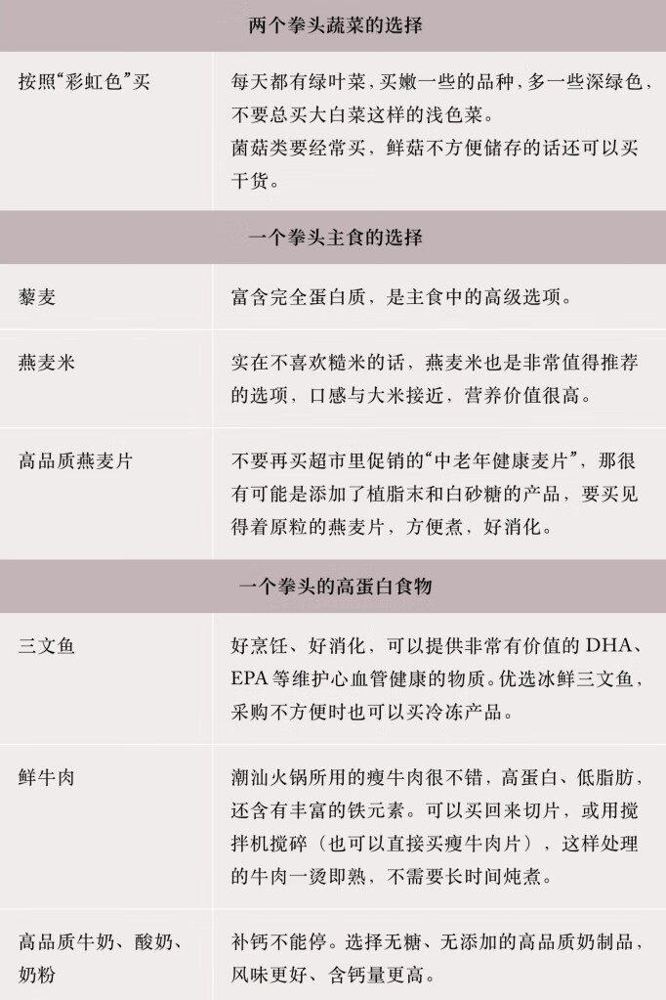

相较于“无糖饼干”“老年人高钙藕粉”“老年人保健品”，上面这些食物更能带来实际的健康价值。

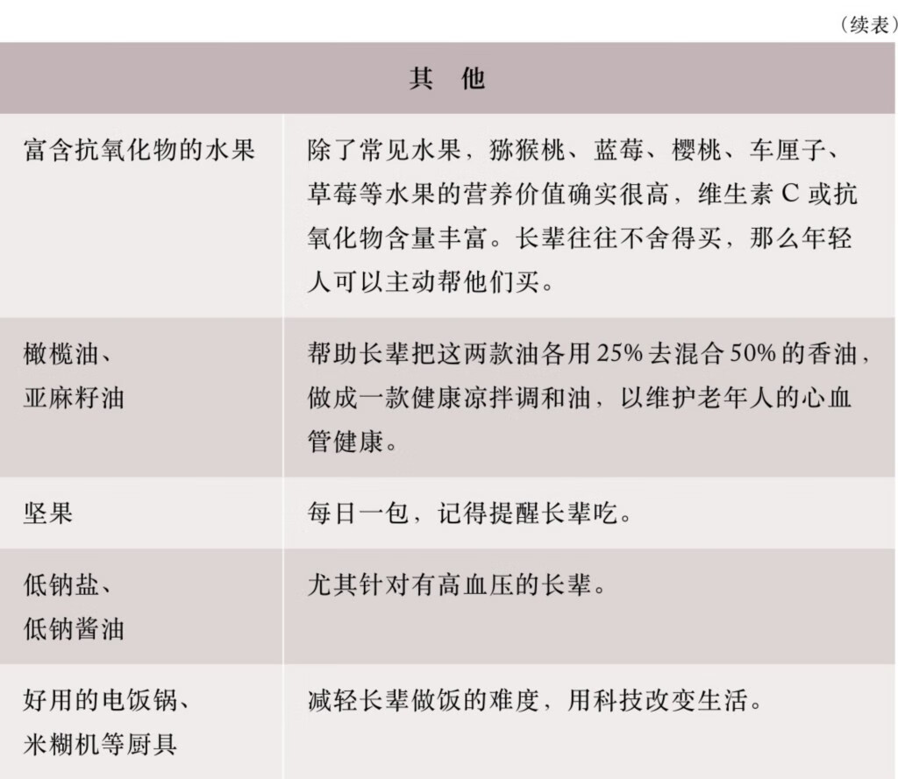

# 高血压患者，该怎么吃？

如果已经患有高血压，应该怎么做？可以按照下面的5个步骤走。1．减肥

控制体重刻不容缓。除了关注体重，尤其要注意“肚子胖”。若内脏脂肪堆积，高血压的患病风险也会随之增加。

2．严格限盐

高钠食物摄入过多是诱发高血压的元凶，适量减少钠盐摄入可以有效地降低血压，每日盐摄入量最好控制在5克以内。但不只是食盐，绝大多数调味酱料都含有盐。挂面等预包装食品，甚至也含有不少的盐。购买同一类产品时要做横向比较，选择钠含量最低的那一款。

3．高钾饮食

减少钠的同时，也一定要增加膳食中的钾含量，这么做有助于平衡体内的钠离子含量，对改善血压有非常重要的作用。

新鲜蔬菜、水果都是富含钾元素的食物，每日争取吃够500克蔬菜和250克水果，增加餐盘中的色彩。口蘑、香菇、紫菜、木耳、番茄、绿叶菜、香蕉、牛油果等都是富含钾元素的食物。主食可用土豆等薯类替代部分米面，薯类富含钾元素，对高血压人群也非常有益。

4．加强运动

运动是健康的基石，可以改善血压水平。

5．缓解压力，调节心情

现代社会生活节奏快，工作压力大，是高血压发病率高的一大原因。精神压力的增加，会导致交感神经兴奋，从而引起血压升高。在紧张的生活中，适当用科学的方法给自己松松绑。运用冥想、运动等方式为自己解压，通过阅读、学习等方式让自己思维更开阔，避免钻牛角尖，都是非常值得尝试的方法。

特别提醒，由于西柚会与降压药物相互作用，极大地增强药力，可能会造成血压过低。所以高血压且服药的人群尽量避免食用西柚。

来自京东读书

导出日期：2024-05-13

