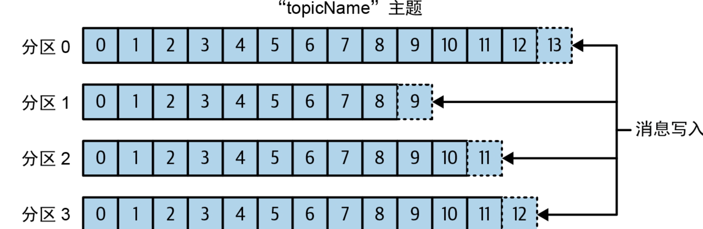

1. 初识Kafka

## 1.1　发布与订阅消息系统

数据（消息）的发送者（发布者）不会直接把消息发送给接收者，这是发布与订阅消息系统的一个特点。发布者以某种方式对消息进行分类，接收者（订阅者）通过订阅它们来接收特定类型的消息。发布与订阅系统一般会有一个broker，也就是发布消息的地方。

真正需要的是一个单一的集中式系统，它可以用来发布通用的数据，并且规模可以随着公司业务的增长而增长。

## 1.2　Kafka登场

Kafka就是为了解决上述问题而设计的一款基于发布与订阅模式的消息系统。

### 1.2.1　消息和批次

Kafka的数据单元被称为消息。消息可以有一个可选的元数据，也就是键。当需要以一种可控的方式将消息写入不同的分区时，需要用到键。最简单的例子就是为键生成一个一致性哈希值，然后用哈希值对主题分区数进行取模，为消息选取分区。这样可以保证具有相同键的消息总是会被写到相同的分区中（前提是分区数量没有发生变化）​。

为了提高效率，消息会被分成批次写入Kafka。批次包含了一组属于同一个主题和分区的消息。如果每一条消息都单独穿行于网络中，那么就会导致大量的网络开销，把消息分成批次传输可以减少网络开销。不过，这需要在时间延迟和吞吐量之间做出权衡：批次越大，单位时间内处理的消息就越多，对单条消息来说，其传输时间就越长。消息批次会被压缩，这样可以提升数据的传输和存储性能，但需要做更多的计算处理。

### 1.2.2　模式

### 1.2.3　主题和分区

Kafka的消息通过主题进行分类。主题就好比数据库的表或文件系统的文件夹。主题可以被分为若干个分区，一个分区就是一个提交日志。

需要注意的是，由于一个主题一般包含几个分区，因此无法在整个主题范围内保证消息的顺序，但可以保证消息在单个分区内是有序的。

生产者创建消息。在其他发布与订阅系统中，生产者可能被称为发布者或写入者。一条消息会被发布到一个特定的主题上。在默认情况下，生产者会把消息均衡地分布到主题的所有分区中。不过，在某些情况下，生产者会把消息直接写入指定的分区，这通常是通过消息键和分区器来实现的。分区器会为键生成一个哈希值，并将其映射到指定的分区，这样可以保证包含同一个键的消息被写入同一个分区。生产者也可以使用自定义的分区器，根据不同的业务规则将消息映射到不同的分区。

消费者读取消息。在其他发布与订阅系统中，消费者可能被称为订阅者或读取者。消费者会订阅一个或多个主题，并按照消息写入分区的顺序读取它们。消费者通过检查消息的偏移量来区分已经读取过的消息。偏移量（不断递增的整数值）是另一种元数据，在创建消息时，Kafka会把它添加到消息里。在给定的分区中，每一条消息的偏移量都是唯一的，越往后消息的偏移量越大（但不一定是严格单调递增）​。消费者会把每一个分区可能的下一个偏移量保存起来（通常保存在Kafka中）​，如果消费者关闭或重启，则其读取状态不会丢失。

消费者可以是消费者群组的一部分，属于同一群组的一个或多个消费者共同读取一个主题。群组可以保证每个分区只被这个群组里的一个消费者读取

消费者与分区之间的映射通常被称为消费者对分区的所有权关系。

通过这种方式，消费者可以读取包含大量消息的主题。而且，如果一个消费者失效，那么群组里的其他消费者可以接管失效消费者的工作。

### 1.2.5　broker和集群

一台单独的Kafka服务器被称为broker。broker会接收来自生产者的消息，为其设置偏移量，并提交到磁盘保存。broker会为消费者提供服务，对读取分区的请求做出响应，并返回已经发布的消息。

broker组成了集群。每个集群都有一个同时充当了集群控制器角色的broker（自动从活动的集群成员中选举出来）​。控制器负责管理工作，包括为broker分配分区和监控broker。在集群中，一个分区从属于一个broker，这个broker被称为分区的首领。一个被分配给其他broker的分区副本（参见图1-7）叫作这个分区的“跟随者”​。分区复制提供了分区的消息冗余，如果一个broker发生故障，则其中的一个跟随者可以接管它的领导权。所有想要发布消息的生产者必须连接到首领，但消费者可以从首领或者跟随者那里读取消息。第7章将详细介绍如何操作集群（包括复制分区）​。

保留消息（在一定期限内）是Kafka的一个重要特性。broker默认的消息保留策略是这样的：要么保留一段时间（如7天）​，要么保留消息总量达到一定的字节数（如1 GB）​。当消息数量达到这些上限时，旧消息就会过期并被删除。

